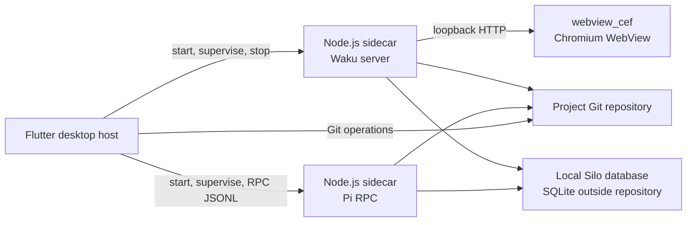

# Silo Studio first-version plan

> Take Silo Studio from an empty `silo-ai/silo-studio` repository to a
> releasable desktop application whose first-run journey is: create or open a
> Git project, see its Waku application, ask Pi to change it, and keep the
> application, Silo data, and Git history in sync.

This plan turns the [Silo Studio overview](../studio.md) into an implementation
sequence. It covers the Studio host repository and the generated project
repositories it manages; those are different repositories with different
lifecycles.

## First-version contract

### The release promise

A local user can:

1. Install Studio on a supported desktop platform.
2. Create a new project from Studio's Waku template or open an existing Git
   repository with a usable `origin` remote.
3. See the project's Waku application in the embedded Chromium WebView.
4. Give Pi a natural-language request in the agent sidebar and see its streamed
   response, tool activity, and file changes.
5. See source changes through Waku/Vite HMR and see Silo-backed data changes
   invalidate the affected application view.
6. Inspect Git status, commits, and diffs, then safely restore an earlier
   application version.
7. Close Studio, reopen the project locally, and observe the same application
   and local Silo workspace without losing its local identity.

The first release is a **desktop-only, local-first** product for macOS,
Windows, and Linux. It supports one active project per Studio window and does
not turn Silo synchronization into live replication.

### Explicit non-goals

Do not expand the first release to include:

- Flutter Web, iOS, or Android hosts;
- multiple users or a hosted Studio server;
- Pi and Waku in the same Node.js process;
- a public network endpoint for the local Waku or Pi runtimes;
- a general-purpose plugin marketplace;
- GitHub authentication, repository creation, or push/pull backup UI;
- Git-style application branches managed by Silo; or
- background Silo replication.

A project may still have a Git `origin` remote because Silo uses that remote to
select its local database. Studio v1 validates or configures that origin but
does not authenticate with a remote provider or synchronize with GitHub. Silo
checkpoint synchronization, when exposed, remains an explicit pull/push
workflow and is separate from Git history.

### End-to-end acceptance story

The release is not complete until this scenario works on a clean machine:

1. Launch Studio and create a project with a user-provided stable `origin`
   URL, or open an existing Git repository with a usable `origin` remote.
2. Studio creates the Git worktree, validates or configures `origin`, installs
   the Waku project dependencies, and initializes the local Silo database
   outside the worktree.
3. Studio starts independent Waku and Pi Node.js sidecars and displays the
   application and agent sidebar.
4. Ask Pi to add a small page and a Silo-backed table. Pi edits the repository,
   runs the relevant checks, and reports the result through the sidebar.
5. The WebView reflects source changes through HMR. A supported application
   mutation and an agent mutation both reach the same Silo database and cause
   the appropriate application refresh.
6. Inspect the resulting commit and diff in Studio, restore a prior version
   without silently deleting uncommitted work, and verify the application still
   starts.
7. Close Studio, reopen the project locally, and observe the same application
   and local Silo workspace.
8. Close Studio and verify that both sidecars terminate without corrupting the
   project or leaving stale child processes.

## Target architecture

The Studio source repository contains the Flutter host, sidecar integration,
project template, packaging assets, and tests. A user's project repository
contains the Waku application and its project-local instructions.

The process boundary is intentional:

- Waku and Pi use the same bundled Node.js runtime where practical, but they
  remain separate processes.
- Waku serves only a loopback HTTP endpoint for the WebView.
- Flutter starts Pi with `--mode rpc` and consumes its strict LF-delimited
  JSONL stream over stdin/stdout or local IPC; Pi is not routed through Waku's
  HTTP handlers.
- The sidecars share the project repository and local Silo state but do not
  share in-memory state.
- Flutter owns readiness, logs, crash detection, independent restart, and
  shutdown for both sidecars.

## Execution plan

### Phase 0: validate the risky assumptions

Before building product UI, create a small disposable spike that proves the
runtime choices on the development machine and records platform gaps.

- Start a minimal Flutter desktop window with `webview_cef`.
- Launch a fixture Node process from Flutter with a repository working
  directory, a bundled-runtime path, an ephemeral loopback port, stdout/stderr
  capture, and clean termination.
- Run the Waku starter in the fixture project and verify server-rendered
  content, client interaction, HMR, and a health check.
- Launch Pi in RPC mode, parse JSONL using LF framing, stream an assistant
  response, abort a run, and handle an extension UI request.
- Open one Silo database from separate Node processes, perform a supported
  mutation, and observe it through one long-lived mutation-journal connection.
- Confirm how CEF runtime assets, Node binaries, project dependencies, and
  native SQLite support will be packaged on each desktop target.

**Exit gate:** the team has a written decision for the Waku start command, Pi
transport, Node/dependency packaging, CEF packaging, and the minimum platform
matrix. Do not build the main UI around an unverified process or WebView API.

### Phase 1: create and stabilize `silo-ai/silo-studio`

Bootstrap the existing empty GitHub repository for Studio itself and make
its first commit a healthy cross-language application repository rather than a
throwaway prototype. This source-repository hosting is separate from the
user-facing GitHub integration deferred beyond v1.

- Initialize the Flutter desktop application for macOS, Windows, and Linux.
- Add the repository license, README, contribution guidance, agent
  instructions, design directory, and security policy.
- Establish a small, explicit source layout for the host, sidecar launchers,
  template, assets, unit tests, integration tests, and packaging scripts.
- Pin Flutter/Dart, Node.js, Waku, Pi, Silo, and package-manager versions.
  Silo currently requires Node.js 24.10.0 or newer.
- Keep JavaScript/TypeScript sidecar code in a lockfile-managed workspace and
  keep the Flutter dependency graph separate from project dependencies.
- Add CI for Dart analysis/tests, TypeScript checks/tests, formatting, template
  validation, and at least one packaged desktop build.
- Define artifact naming, versioning, release notes, and the supported OS/CPU
  combinations before platform-specific code spreads through the host.

**Exit gate:** a fresh checkout can run host and sidecar tests, and a CI-built
empty Flutter shell launches on the primary development platform.

### Phase 2: build the Flutter host and process supervisor

Implement the durable host concepts before adding project-specific behavior.

- Add the Studio window shell with the toggleable agent sidebar and application
  surface.
- Model project lifecycle explicitly: no project, starting, ready, stopping,
  failed, and switching.
- Implement a sidecar supervisor with separate specifications for Waku and Pi:
  executable, arguments, working directory, environment, log sinks, readiness,
  restart policy, and shutdown behavior.
- Resolve project paths without relying on the user's `PATH` for Node.js. Use a
  platform-matched bundled Node runtime in packaged builds.
- Allocate a free loopback port for Waku, wait for an HTTP readiness response,
  and only then navigate `webview_cef`.
- Keep Pi on process IPC. Correlate RPC requests and streamed events, preserve
  partial output, and make cancellation and EOF behavior explicit.
- Surface actionable startup failures in the UI while keeping secrets out of
  logs and diagnostics.
- Handle project switches in order: stop or persist the current agent session,
  stop both sidecars, close observers, start the new project, then attach the
  new UI streams.
- Make shutdown idempotent and verify that child processes are reaped on
  normal close, crash, and force-quit paths.

**Exit gate:** a fixture Waku server and fixture Pi RPC process can be started,
restarted independently, observed, and stopped from Flutter without leaked
processes or a WebView navigating before readiness.

### Phase 3: establish the project template and first-run flow

Build the generated project repository as a stable product boundary.

- Start from Waku's `fs-router/basic` example, then replace its Tailwind setup
  with Mantine and application-authored CSS Modules.
- Add the template's `package.json`, lockfile policy, Waku configuration, root
  styles, sample route, and project-local `AGENTS.md`.
- State the server/client boundary in the instructions: Silo modules are
  server-only, client components receive serializable data, and database-backed
  pages render dynamically.
- Define create/open/import flows for a Git worktree. New projects must have a
  usable `origin` before Silo resolves their workspace identity.
- For new projects, require a user-provided stable origin URL or an existing
  local remote and configure or validate it locally. Do not implement remote
  provider authentication or repository creation in this phase.
- Install project dependencies deterministically using the packaged runtime and
  the selected package-manager strategy. Do not silently fall back to a system
  Node installation in a packaged build.
- Create the initial Git commit and initialize the local Silo database through
  supported APIs. Keep the database outside the project worktree.
- Preserve user-owned files when opening an existing repository; never replace
  an existing template or database without an explicit confirmation.

**Exit gate:** create and open flows produce a recognizable project repository,
Waku can start it, Silo resolves the expected workspace, and the template's
server/client instructions are present.

### Phase 4: integrate Waku and Silo

Make the application data path correct before adding broad Studio features.

- Add a small server-only Silo integration module to the Waku project boundary.
  Use `resolveWorkspace()` and `SiloDatabase` from `@silo-ai/silo` rather than
  opening SQLite from client code.
- Implement the first complete data path: schema/bootstrap, server read,
  server action or API-handler write, serializable props, and a dynamic page
  that displays current data.
- Keep all writes inside Silo's supported row, schema, saved-query, or report
  mutation boundaries. Keep SQL reads read-only.
- Keep one long-lived read-only `SiloDatabase` connection for the invalidation
  observer. Perform an initial full refresh, page journal entries, map
  `resource_tags` to affected application resources, and handle the bounded
  retention window.
- Treat `full_refresh_required`, `unknown_change`, and `data_version` changes
  as broad invalidation signals. Never treat the journal as an audit log or
  replay protocol.
- Connect invalidation to the running Waku application so affected routes or
  RSC content refresh without asking the browser to open SQLite.
- Define behavior when the database is absent, the schema is invalid, a writer
  lock is held, or the project is switched while a read connection is open.
- Exercise concurrent app and agent mutations and verify that both processes
  observe the same committed state.

**Exit gate:** a fixture application can read and write Silo data from the
correct server boundary, an external mutation causes the expected refresh, and
stale or unknown journal state falls back to a correct full refresh.

### Phase 5: integrate Pi into the agent sidebar

Make the coding loop useful while preserving the process and security
boundaries.

- Start Pi with the project repository as its working directory and a
  project-scoped session policy. Use `--mode rpc`; implement strict LF-delimited
  JSONL parsing rather than a generic Unicode-aware line splitter.
- Render user prompts, streamed assistant text, thinking/tool-call status,
  tool output, errors, queued steering/follow-up messages, and completion state.
- Support prompt submission, steering, follow-up, abort, session creation,
  resume, model selection, and the minimum session status needed by the UI.
- Implement the RPC extension UI sub-protocol for confirmation, selection,
  input, editor, and notification requests, or deliberately reject unsupported
  extension interactions with a visible error.
- Set the Pi working directory and resource loader so project `AGENTS.md`, Silo
  guidance, skills, and extensions are discovered intentionally. Do not grant
  project-local resources silently without a documented trust decision.
- Define credential handling before release: use Pi's supported credential
  mechanisms or a secure host-owned store, never write API keys to project
  files, and redact credentials from process logs and crash reports.
- Decide how a project switch persists or abandons the current session. A
  stopped Waku server must not destroy a still-useful Pi session, and a Pi crash
  must not take down the application WebView.
- Add visible trust and destructive-operation affordances appropriate for an
  agent that can run shell commands and edit the repository.

**Exit gate:** a user can ask Pi to make a small repository change, watch the
stream, abort it, resume the session, and see the resulting Waku HMR update
without exposing Pi through the Waku HTTP server.

### Phase 6: add Git history and safe restoration

Treat Git as the application's durable history, not as an implementation
leak.

- Add a Git adapter for repository status, branches, commits, changed files,
  diffs, and commit selection. Use one implementation consistently across the
  supported platforms.
- Refresh history after Pi commits, user edits, restores, branch changes, and
  project reopen.
- Display useful loading, dirty-worktree, detached-head, merge-conflict, and
  missing-remote states.
- Define restore semantics before implementing the button. The default v1
  behavior should refuse to discard uncommitted work, require confirmation, and
  preserve history with a new restore commit rather than silently rewriting or
  deleting user work.
- Keep Git state separate from Silo state in the UI. A Git commit does not imply
  a Silo checkpoint push, and a Silo mutation does not create a Git commit.
- Test repository locks, concurrent Pi writes, incomplete commits, conflicts,
  and recovery after a failed restore.

**Exit gate:** users can inspect a real project history and recover a prior
application version without silent data loss or confusing the Git and Silo
lifecycles.

### Phase 7: package the desktop application

Turn the development topology into a reproducible installation.

- Bundle the platform-matched Node.js runtime and the Pi runtime/package.
- Bundle or otherwise provision the Waku project dependencies without relying
  on a user's globally installed Node.js or package manager.
- Package the CEF runtime required by `webview_cef` for each target.
- Separate writable user data (sessions, credentials, logs, caches, and project
  metadata) from the signed application bundle.
- Add macOS signing/notarization, Windows signing and installer behavior, and
  Linux artifact packaging appropriate to the supported release channels.
- Bind local servers to loopback, avoid predictable unauthenticated control
  ports, and ensure child-process arguments and environment do not contain
  secrets unnecessarily.
- Verify clean install, upgrade, uninstall, offline startup, missing runtime,
  sidecar crash, and forced shutdown behavior.
- In packaged mode, serve a built Waku application; reserve the Waku dev server
  and HMR workflow for development builds.

**Exit gate:** a clean machine with no system Node.js installation can launch a
packaged project, use Pi, render Waku, and close without orphaned processes.

### Phase 8: harden, document, and release

Run the full product loop before calling the release complete.

- Add unit tests for process supervision, port readiness, JSONL framing, RPC
  correlation, Git operations, Silo journal cursor handling, and project state
  transitions.
- Add integration tests with fixture Waku and Pi processes, a real temporary
  Git repository, and a real local Silo database.
- Add desktop end-to-end tests for create, open, HMR, agent edits, app writes,
  journal-driven refresh, Git history, restore, project switch, crash recovery,
  and shutdown.
- Run a platform matrix covering macOS, Windows, and Linux, including the
  architectures that will receive release artifacts.
- Run the acceptance story on clean machines and with network/API failures.
- Document installation, project lifecycle, credentials, trust boundaries,
  sidecar diagnostics, Git restore behavior, Silo invalidation, and explicit
  synchronization.
- Create a release checklist with artifact hashes, signing status, known
  limitations, rollback instructions, and a support path for corrupted or
  partially initialized projects.

**Exit gate:** every first-version promise has an automated or recorded manual
verification, and failures leave enough diagnostics to recover without
modifying user data destructively.

## Recommended milestone sequence

Use these milestones to keep the implementation vertical rather than building
all of one layer before proving the product loop:

| Milestone             | Demonstrates                                                       | Depends on |
| --------------------- | ------------------------------------------------------------------ | ---------- |
| M0 Runtime spike      | Flutter can host CEF and supervise Node, Waku, and Pi              | None       |
| M1 Empty Studio shell | New repository, CI, window shell, and sidecar state machine        | M0         |
| M2 Live template      | Create/open a project and render Waku in the WebView               | M1         |
| M3 Durable data loop  | Server-only Silo reads/writes and journal-driven refresh           | M2         |
| M4 Agent loop         | Pi RPC sidebar can change the project and survive sidecar failures | M2, M3     |
| M5 Local history      | Git status, diff, history, and safe restore                        | M4         |
| M6 Release candidate  | Signed packages and clean-machine acceptance story                 | M5         |

At every milestone, keep the previous milestone runnable. Do not add remote
provider features, additional templates, or platform-specific polish while the
local Waku/Pi/Silo loop is still unproven.

## Decisions to close early

Record these decisions in the new repository before the relevant phase starts:

- the exact Waku development and production entry points;
- how project dependencies are installed or bundled without system Node;
- whether the Waku sidecar or a dedicated host bridge owns Silo invalidation;
- how Pi sessions, project trust, extensions, and credentials are scoped;
- whether Pi RPC uses direct stdin/stdout for the first release or a local IPC
  wrapper;
- the Git implementation and safe restore operation;
- how Studio validates or configures a stable origin without remote-provider
  authentication;
- the first release's OS/CPU matrix and CEF distribution strategy; and
- the recovery behavior for an absent database, invalid schema, failed sidecar,
  dirty worktree, interrupted origin configuration, or crashed Studio process.

Each decision should include an observable test or acceptance check. Keep
implementation detail in the new repository's focused design documents once a
boundary has its own protocol or lifecycle; keep this file as the ordered v1
plan.
