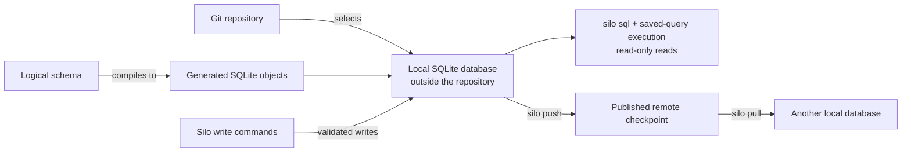

# How Silo Works

> Understand the four boundaries behind the getting-started proof before deciding how much of Silo to adopt.

The [Getting started](../getting-started.md) walkthrough showed one row
accepted and one bad value rejected. The result is trustworthy only if the
repository, schema, write, and sharing boundaries are clear.



## 1. Git selects a local database

Silo resolves the current Git worktree and maps its normalized `origin` to a
local database identity. If the repository has no `origin`, Silo uses a stable
detached identity for that local repository. `silo status` shows the selected
identity and database path.

The active SQLite database stays outside the repository. Git does not commit it,
and a clone does not copy its rows. Each machine therefore has its own local
working database until you explicitly synchronize it. See [Workspace and schema
model](workspace-and-schema.md) for identity selection and local database
paths.

## 2. The logical schema is the contract

The logical schema is the source of meaning. It defines tables, columns,
semantic types, nullability, keys, and other rules. Silo compiles that contract
into generated SQLite objects such as `STRICT` tables, checks, foreign keys,
indexes, and triggers.

Supported Silo mutations validate input against the logical schema before
committing it. In the walkthrough, `title: 42` was rejected because `title` is
`text`; the generated database and the command boundary prevent that value from
becoming an ordinary valid row. Comments explain meaning to people and agents;
constraints and policies enforce the parts that must hold.

Use [Design a schema](../guides/design-a-schema.md) when you are ready to put a
real repository concept under this contract.

## 3. Silo commands write; reads stay read-only

Use Silo's row and schema commands for supported changes such as adding,
updating, deleting, or upserting rows. A successful mutation commits local
SQLite state through Silo's validation and transaction boundary.

`silo sql` opens a read-only SQLite connection. Running a saved query is also
read-only, and reports render query results from this same database rather than
creating a second store. This keeps joins, filters, aggregates, and reusable
reads available without turning an ad hoc SQL statement into a mutation.

A program that opens the SQLite file directly is outside Silo's command boundary.
Do not use a direct SQLite writer when you need Silo validation, generated values,
or synchronization bookkeeping.

See [Work with rows](../guides/work-with-rows.md) for the normal row operations,
[Run saved queries](../guides/run-saved-queries.md) for reusable reads, and
[Publish a refreshable report](../guides/publish-a-report.md) for human-facing
output.

## 4. Sharing is explicit checkpoint exchange

Without synchronization, all changes remain in the local database. When a
remote is configured, the normal loop is:

```text
silo pull  ->  read and write locally  ->  inspect  ->  silo push
```

`pull` brings down the current published checkpoint and reapplies compatible
local work. `push` creates and verifies a new checkpoint before publishing it.
The remote is published database state, not a live SQL server, and neither
operation runs in the background.

If concurrent changes cannot be combined without guessing, Silo stops instead
of silently choosing a last writer. The local database remains available for
reconciliation, and the reconciled result must be written deliberately. Sharing
also requires a configured S3-compatible remote and adds storage, transfer, and
operator setup; it is not live replication.

See [Synchronize a database](../guides/synchronize.md) for the operator workflow
and [Synchronization model](synchronization.md) for checkpoint, conflict, and
durability details.

## What Silo does not do

- It does not put the active database inside the Git repository.
- It does not synchronize in the background or turn the remote into a live SQL
  server.
- It does not provide Git-style branches or a user-facing, actor-attributed
  audit history.
- It does not accept raw SQL mutations as a shortcut around the logical schema.

## Next

Start adoption with [Design a schema](../guides/design-a-schema.md). After that,
use [Work with rows](../guides/work-with-rows.md) for ordinary operations.
Saved queries, [refreshable reports](../guides/publish-a-report.md), and
[Synchronization](../guides/synchronize.md) are optional branches when the
workflow needs them.
