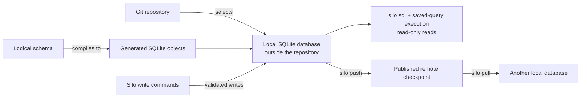

# How Silo Works

> Learn where your data lives, how writes are checked, and how changes are shared.

Silo gives each Git repository a local SQLite database. The logical schema
sets the rules for its data, and Silo commands check writes against those rules.
SQL, saved queries, and reports let you read the same database.

The diagram shows how these pieces fit together. Sharing with another machine
is optional and requires explicit push and pull commands.



## 1. Git selects a local database

By default, Silo uses the repository's `origin` URL to choose a local database.
If there is no `origin`, it assigns a stable local identity instead. Run
`silo status` to see the selected identity and database path.

The active SQLite database stays outside the repository. Git does not commit it,
and a clone does not copy its rows. Each machine therefore has its own local
working database until you explicitly synchronize it. See [Workspace and schema
model](workspace-and-schema.md) for identity selection and local database
paths.

## 2. The logical schema is the contract

The **logical schema** is the stored definition of your tables and their rules.
It describes:

- What each table and column means
- Which values a column accepts, including whether it can be `null`
- Which keys identify rows and connect tables
- Which policies generate values or restrict changes

Silo turns these definitions into **generated SQLite objects**, including
`STRICT` tables, checks, indexes, and triggers. These enforce the parts of the
schema that SQLite can check. Silo commands also validate input before saving it.

For example, the [Getting started](../getting-started.md) table requires a text
`title`. A write containing `"title": 42` fails without adding a row.

Comments help agents understand the data. Use constraints and policies for
rules that Silo must enforce; a comment alone does not enforce a rule.

Use [Design a schema](../guides/design-a-schema.md) to define your own tables.

## 3. Silo commands write; reads stay read-only

Use Silo commands to change tables and rows. Each successful write is checked
and committed to the local database.

There are three ways to read the data:

- `silo sql` runs read-only SQL.
- Saved queries let you reuse SQL with typed arguments.
- Reports use read-only Silo helpers and save their latest Markdown output.

Report scripts can also call Node APIs directly. They are trusted local code,
so the read-only helpers do not make a script safe to run.

Writing directly to the SQLite file bypasses Silo's input validation,
generated values, and synchronization bookkeeping. Use the supported commands
when you need those guarantees.

See [Work with rows](../guides/work-with-rows.md) for writes and lookups.
[Run saved queries](../guides/run-saved-queries.md) and
[Publish a refreshable report](../guides/publish-a-report.md) cover reusable reads.

## 4. Sharing is explicit checkpoint exchange

Without synchronization, all changes remain in the local database. When a
remote is configured, the normal loop is:

```text
silo pull  ->  read and write locally  ->  inspect  ->  silo push
```

`pull` brings down the current published checkpoint and reapplies compatible
local work. `push` creates and verifies a new checkpoint before publishing it.
The remote is published database state, not a live SQL server, and neither
operation runs in the background.

If concurrent changes conflict, Silo stops instead of silently choosing a last
writer. You can inspect the local database, decide how to resolve the conflict,
and write the result deliberately.

Sharing requires S3-compatible storage that you configure and pay for. It does
not keep machines in sync automatically.

See [Synchronize a database](../guides/synchronize.md) for the operator workflow
and [Synchronization model](synchronization.md) for checkpoint, conflict, and
durability details.

## What Silo does not do

- It does not put the active database inside the Git repository.
- It does not synchronize in the background or turn the remote into a live SQL
  server.
- It does not provide Git-style branches or a user-facing, actor-attributed
  audit history.
- It does not accept raw SQL mutations as a shortcut around the logical schema.

## Next

- [Design a schema](../guides/design-a-schema.md) to define the data for your work.
- [Work with rows](../guides/work-with-rows.md) to read and change it.
- [Synchronize a database](../guides/synchronize.md) when you need to share it.
