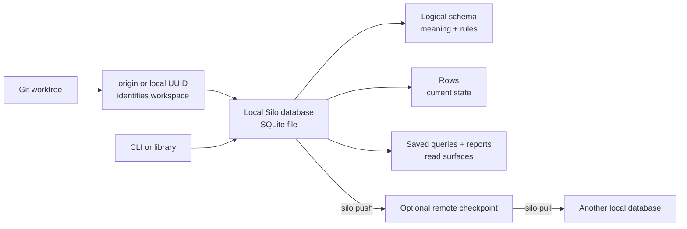
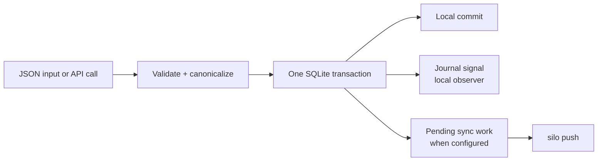

# How Silo Works

> Build the right mental model before choosing a schema, writing rows, or sharing a database with another machine.

## The short version

Silo gives a Git repository a local SQLite database. Repository-local state in
`.git/silo.json` selects a normalized Git remote identity or a persistent local
UUID. The database itself is kept outside the repository on the local machine.

You describe data in a logical schema. Silo compiles that description into
SQLite tables and constraints, then uses the schema to validate row input and
control supported mutations. Saved queries and reports are read surfaces over
the same database.

Synchronization is optional and explicit. `silo push` publishes the local
database, and `silo pull` brings down the latest published database and
reapplies compatible local work. There is no background replication.



The important relationship is that the local database is the active working
copy. The remote is a published copy used to share or restore that state; it
is not a live database connection.

## Five things to remember

### 1. The workspace chooses the database

Silo resolves the current Git worktree, then maps its normalized `origin` or
local detached UUID to a local database path. Run `silo status` when you need
to confirm which workspace and database a command will use.

Automatic selection uses `origin` when it exists and the detached UUID
otherwise. Adding `origin` automatically moves an existing unsynchronized
detached database when the origin identity has no database. Use `silo switch`
to select another named remote or the detached identity deliberately.

See [Workspace and schema model](workspace-and-schema.md) for database paths,
identity normalization, and recovery from physical schema drift.

### 2. The schema is the contract

The logical schema describes what each table and column means, which values are
accepted, which lifecycle rules apply, and which named semantic relations link
entities. A relation adds domain meaning to an existing foreign key; it does
not replace the physical constraint. Silo compiles the physical contract to
SQLite `STRICT` tables, keys, checks, indexes, and triggers.

The logical schema is authoritative. Use `silo schema show` or
`silo schema export` to understand the contract; use `silo schema ddl` only
when diagnosing the generated SQLite objects.

Comments explain meaning to people and agents. Keys, constraints, and policies
enforce the invariants.

### 3. Commands are the write boundary

Use row commands to add, update, delete, and upsert data. Use `silo sql` to
join, filter, aggregate, or inspect existing rows; that connection is
read-only.

Every supported write commits as one local SQLite transaction. A write can
also record a pending synchronization transaction when synchronization is
configured, and a bounded local journal entry for consumers that need to know
which resources may be stale.



The journal is an invalidation signal, not an audit log or replay history. Read
[Mutation journal](mutation-journal.md) only when building a long-lived local
consumer.

### 4. Queries and reports are reusable reads

A saved query stores read-only SQL and a typed parameter contract. It turns a
repeated read into a repository-defined command.

A report stores Markdown framing plus named query slots. Refreshing a report
runs those queries and stores a new rendered Markdown snapshot; it does not
ask an agent to rewrite the prose.

Both are stored beside the source rows in the same Silo database. They are
convenient ways to read and present state, not separate databases.

Continue with [Run saved queries](../guides/run-saved-queries.md) or [Publish a
refreshable report](../guides/publish-a-report.md) when the basic row workflow
is clear.

### 5. Synchronization shares published database state

The normal shared-work loop is:

```text
silo pull  ->  read and write locally  ->  inspect  ->  silo push
```

`pull` starts from the remote's current checkpoint and reapplies compatible
local pending work. `push` creates and verifies a new checkpoint before
publishing it. If concurrent changes cannot be combined without guessing,
Silo stops and preserves the local database for reconciliation.

Schema changes are more restrictive than row changes: they are published as
full checkpoints and are not merged with concurrent schema changes.

See [Synchronize a database](../guides/synchronize.md) for the operator
workflow and [Synchronization model](synchronization.md) for checkpoint,
conflict, and durability details.

## What Silo does not do

- It does not put the active database inside the Git repository.
- It does not synchronize in the background.
- It does not treat the remote as a live SQL server.
- It does not provide Git-style branches or user-visible audit history.
- It does not accept raw SQL mutations as a shortcut around the schema.

Start with [Getting started](../getting-started.md) to create one table, write
one row, and read it back.
