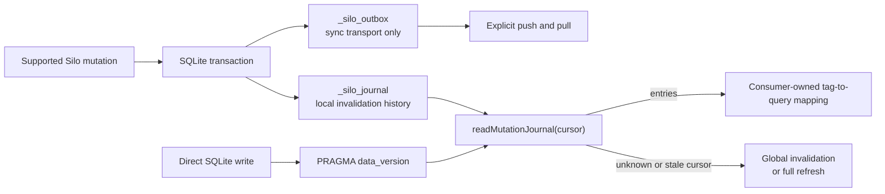

# Mutation Journal

> Let a long-lived local consumer notice which Silo resources may be stale without treating synchronization state as a replay log.

This is an advanced library integration, not part of the normal CLI workflow.
The mutation journal is a bounded, local invalidation signal at Silo's
database/library boundary. An out-of-process Node.js consumer can keep a read
connection open, read entries by sequence, and map Silo's resource tags to its
own active queries.

The package exposes the `SiloDatabase` API for this purpose. There is no CLI polling command, HTTP endpoint, SSE stream, WebSocket, or browser implementation in this feature.

Applications that need several validated row mutations to commit together
should use [Atomic transactions](atomic-transactions.md). That API creates one
journal entry for a successful multi-table row transition; this page focuses
on how a long-lived consumer reads and interprets the resulting invalidation
signal.

## Choose the signal

Silo exposes three related signals with different jobs:

| Signal                              | Tells the consumer                                                                                | Retention or scope                                                                  | Consumer action                                                               |
| ----------------------------------- | ------------------------------------------------------------------------------------------------- | ----------------------------------------------------------------------------------- | ----------------------------------------------------------------------------- |
| `readMutationJournal()` entries     | A supported Silo mutation committed and has resource context.                                     | The newest 1,000 entries; each read returns at most 100.                            | Map `resource_tags` to the queries that may be stale.                         |
| `full_refresh_required`             | The requested cursor is older than the retained window, or the database has no journal table yet. | No replay guarantee outside the retained window.                                    | Refresh all resources, then advance the cursor to `latest_sequence`.          |
| `unknown_change` and `data_version` | A commit was detected that Silo could not attribute to a journal entry.                           | `PRAGMA data_version` only reports a change on the long-lived observing connection. | Treat the database as globally stale; do not assign the change to a resource. |
| `_silo_outbox`                      | Synchronization transport state for a configured remote.                                          | Cleared after a successful push.                                                    | Do not use it as the local invalidation feed.                                 |

The journal and synchronization outbox are written in the same SQLite transaction when synchronization is configured, but they remain separate state. Clearing the outbox does not remove local journal history.

The paths are separate until the consumer interprets the result:



## Keep one observing connection

Install Silo as a dependency of the process that owns the observer:

```sh
pnpm add @silo-ai/silo
```

Open one read-only `SiloDatabase` instance and reuse it for the observer's lifetime. `readMutationJournal()` compares the current `data_version` and journal sequence with the values observed by the previous call; creating a new instance for every poll would reset that baseline and hide external commits. `getDataVersion()` exposes the raw current counter when needed, but it does not replace the journal read or advance its observer baseline.

```ts
import { SiloDatabase, resolveWorkspace } from '@silo-ai/silo'

let cursor = 0
const observer = SiloDatabase.open(resolveWorkspace())

try {
  const page = observer.readMutationJournal(cursor)

  if (page.full_refresh_required || page.unknown_change) {
    await refreshAllResources()
    // A full refresh establishes a new application snapshot. Skip all entries
    // that were covered by that snapshot, including entries returned with an
    // unknown-change signal.
    cursor = page.latest_sequence
  } else {
    for (const entry of page.entries) invalidate(entry.resource_tags)
    cursor = page.next_sequence
  }
} finally {
  observer.close()
}
```

Repeat the read with the same `observer` after the consumer's polling interval. When a page contains entries but `next_sequence` is less than `latest_sequence`, read again with `next_sequence` until the page is caught up. If the consumer falls behind far enough for `full_refresh_required` to become true, stop replaying entries, refresh the current database state, and resume at the returned `latest_sequence`.

> [!IMPORTANT]
> `data_version` is a detection mechanism, not attribution. A direct SQLite writer can be noticed as an unknown/global change, but the journal cannot identify its actor, infer its resource, or provide before-and-after values.

## Journal entry contract

Each `MutationJournalEntry` contains:

| Field            | Meaning                                                                                                                                                     |
| ---------------- | ----------------------------------------------------------------------------------------------------------------------------------------------------------- |
| `sequence`       | Database-local monotonic sequence assigned to the journal row. Retention can remove older sequence values, so consumers must not assume a gap-free history. |
| `transaction_id` | Unique transaction identity. When synchronization is configured, it is also the corresponding outbox transaction identity.                                  |
| `committed_at`   | ISO timestamp recorded at the mutation's commit boundary.                                                                                                   |
| `operation`      | Structured operation context such as a command, table or resource name, and available row key context. It is metadata, not a replay command.                |
| `resource_tags`  | Opaque resource identifiers intended for consumer-owned invalidation. The `*` tag means that every resource may be stale.                                   |

Silo currently emits these resource tag shapes:

| Mutation family             | Tag                                            | Examples of operation commands                                                                                   |
| --------------------------- | ---------------------------------------------- | ---------------------------------------------------------------------------------------------------------------- |
| Row mutation                | `table:<table-name>`                           | `row.add`, `row.upsert`, `row.update`, `row.delete`                                                              |
| Multi-table row transaction | One `table:<table-name>` tag per touched table | `row.batch` or the caller-supplied operation command                                                             |
| Saved query mutation        | `query:<query-name>`                           | `query.put`, `query.delete`                                                                                      |
| Report mutation             | `report:<report-slug>`                         | `report.put`, `report.refresh`, `report.refresh_error`, `report.delete`                                          |
| Schema or broad mutation    | `*`                                            | `schema.create`, `schema.import`, `table.create`, `table.alter`, `table.drop`, `relation.add`, `relation.remove` |

Use `resource_tags` as the invalidation contract. The consumer, not Silo, decides which active queries depend on a resource. Row tags identify a table rather than promising exact row-level filtering.

## Atomicity and retention

Supported row, saved-query, report, and schema mutation paths append their journal entry before committing the surrounding SQLite transaction. A failed validation, constraint error, or rollback removes the pending journal insert with the rest of the mutation. A successful synchronization push can clear `_silo_outbox`, but it does not clear `_silo_journal`.

The journal retains the newest 1,000 entries. `readMutationJournal(afterSequence, limit)` accepts a non-negative sequence cursor and a positive requested limit, but caps one response at 100 entries. The response exposes `oldest_sequence`, `latest_sequence`, and `next_sequence` so a consumer can page without assuming that sequence numbers are contiguous.

When `afterSequence` is older than `oldest_sequence - 1`, the response has `full_refresh_required: true` and does not return a partial replay. This is an intentional bounded-retention contract: consumers must be able to rebuild their resource state from the current database rather than depending on indefinite event history.

Existing databases opened before the journal table was available have no historical entries to backfill. A writable open creates the table for subsequent mutations. A consumer attaching without an established cursor should perform an initial full refresh; an existing observer should also refresh when the read response indicates that the journal is unavailable or does not cover its cursor.

## Boundaries

The journal is operational change metadata, not a tamper-proof audit log. It does not provide:

- actor authentication or attribution;
- before-and-after value history;
- indefinite replay or consumer cursors managed by Silo;
- SQL parsing or exact query-dependency analysis; or
- resource-specific attribution for arbitrary direct SQLite writes.

For remote durability, checkpoint exchange, and synchronization conflict handling, see [Synchronization model](synchronization.md). For the boundary between Silo's logical schema, managed SQLite objects, and external writers, see [Workspace and schema model](workspace-and-schema.md).
