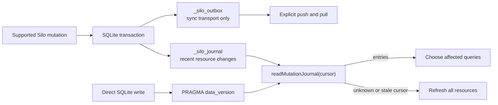

# Mutation Journal

> Let a long-running reader notice changes and refresh the data it displays.

Use the mutation journal when a separate local process needs to notice writes
made through Silo. For example, a dashboard can refresh its issue list after
an agent updates the `issues` table.

The journal records which resources may have changed. It keeps only a limited
number of entries, so the reader must be able to reload current data when it
falls behind. It is not an audit log or a record of every past value.

This feature is a library API on `SiloDatabase`. It does not include a CLI
polling command or a browser connection. Your application owns polling and
refreshing its views.

For several writes that must commit together, use
[Atomic transactions](atomic-transactions.md). A successful transaction that
changes rows creates one journal entry.

## Choose the signal

Use the journal result to decide how much data to refresh. The synchronization
outbox serves a different purpose:

| Signal                              | Tells the consumer                                                                                | Retention or scope                                                                  | Consumer action                                                               |
| ----------------------------------- | ------------------------------------------------------------------------------------------------- | ----------------------------------------------------------------------------------- | ----------------------------------------------------------------------------- |
| `readMutationJournal()` entries     | A supported Silo mutation committed and has resource context.                                     | The newest 1,000 entries; each read returns at most 100.                            | Map `resource_tags` to the queries that may be stale.                         |
| `full_refresh_required`             | The requested cursor is older than the retained window, or the database has no journal table yet. | No replay guarantee outside the retained window.                                    | Refresh all resources, then advance the cursor to `latest_sequence`.          |
| `unknown_change` and `data_version` | A commit was detected that Silo could not attribute to a journal entry.                           | `PRAGMA data_version` only reports a change on the long-lived observing connection. | Treat the database as globally stale; do not assign the change to a resource. |
| `_silo_outbox`                      | Synchronization transport state for a configured remote.                                          | Cleared after a successful push.                                                    | Do not use it as the local invalidation feed.                                 |

When synchronization is configured, Silo writes the journal and outbox in the
same transaction. They remain separate: a push can clear the outbox without
clearing the journal.

The diagram shows the two ways a reader can notice changes. Journal tags can
identify affected resources; an unknown external change needs a full refresh:



## Keep one observing connection

Install Silo as a dependency of the process that owns the observer:

```sh
pnpm add @silo-ai/silo
```

Open one read-only `SiloDatabase` and keep it open while polling.
`readMutationJournal()` compares the database with what that instance saw on
its previous call. Opening a new instance for every poll loses that baseline
and can hide external commits.

This example assumes your application supplies:

- `refreshAllResources()`: reload all displayed data; resolve only when complete
- `invalidate(tags)`: mark views using those resources as needing a refresh
- `signal`: an `AbortSignal` used to stop the observer

Run it in an existing Silo workspace. It loads the current data once, polls
once per second when caught up, and closes the connection when stopped:

```ts
import { setTimeout as delay } from 'node:timers/promises'
import { SiloDatabase, resolveWorkspace } from '@silo-ai/silo'

const observer = SiloDatabase.open(resolveWorkspace())

try {
  // Capture the cursor before loading data so writes during that load
  // remain eligible for a later refresh.
  let cursor = observer.readMutationJournal().latest_sequence
  await refreshAllResources()

  while (!signal.aborted) {
    const page = observer.readMutationJournal(cursor)

    if (page.full_refresh_required || page.unknown_change) {
      await refreshAllResources()
      cursor = page.latest_sequence
    } else {
      for (const entry of page.entries) invalidate(entry.resource_tags)
      cursor = page.next_sequence
    }

    if (cursor < page.latest_sequence) continue
    await delay(1000)
  }
} finally {
  observer.close()
}
```

When a read returns only part of the available entries, the loop reads the next
page immediately. If entries have expired or an unknown change is detected,
it reloads current data instead. Errors propagate and close the observer; your
application decides whether to restart it.

`getDataVersion()` exposes SQLite's current counter. It does not advance the
journal reader's baseline or replace a journal read.

> [!IMPORTANT]
> `data_version` is a detection mechanism, not attribution. A direct SQLite writer can be noticed as an unknown/global change, but the journal cannot identify its actor, infer its resource, or provide before-and-after values.

## Journal entry contract

Each `MutationJournalEntry` contains:

| Field            | Meaning                                                                                                                                                     |
| ---------------- | ----------------------------------------------------------------------------------------------------------------------------------------------------------- |
| `sequence`       | Database-local monotonic sequence assigned to the journal row. Retention can remove older sequence values, so consumers must not assume a gap-free history. |
| `transaction_id` | Unique transaction identity. When synchronization is configured, it is also the corresponding outbox transaction identity.                                  |
| `committed_at`   | ISO timestamp recorded at the mutation's commit boundary.                                                                                                   |
| `operation`      | Structured operation context such as a command, table or resource name, and available row key context. It is metadata, not a replay command.                |
| `resource_tags`  | Opaque resource identifiers intended for consumer-owned invalidation. The `*` tag means that every resource may be stale.                                   |

Silo currently emits these resource tag shapes:

| Mutation family             | Tag                                            | Examples of operation commands                                                                                   |
| --------------------------- | ---------------------------------------------- | ---------------------------------------------------------------------------------------------------------------- |
| Row mutation                | `table:<table-name>`                           | `row.add`, `row.upsert`, `row.update`, `row.delete`                                                              |
| Multi-table row transaction | One `table:<table-name>` tag per touched table | `row.batch` or the caller-supplied operation command                                                             |
| Saved query mutation        | `query:<query-name>`                           | `query.put`, `query.delete`                                                                                      |
| Report mutation             | `report:<report-slug>`                         | `report.put`, `report.refresh`, `report.refresh_error`, `report.delete`                                          |
| Schema or broad mutation    | `*`                                            | `schema.create`, `schema.import`, `table.create`, `table.alter`, `table.drop`, `relation.add`, `relation.remove` |

Use `resource_tags` to decide which views need refreshing. For example,
`table:issues` can invalidate every displayed query that reads `issues`. Silo
does not calculate those dependencies for you, and the tag does not identify
which individual rows changed.

## Atomicity and retention

Silo records a journal entry in the same transaction as the change it
describes. If the transaction rolls back, so does the entry. A successful push
can clear `_silo_outbox`; it does not clear `_silo_journal`.

Journal reads have these limits:

- The journal keeps the newest 1,000 entries.
- Each response contains at most 100 entries.
- The cursor must be a non-negative safe integer.
- The requested limit must be a positive safe integer.

Use `next_sequence` to advance through pages. Do not assume every sequence
number still has an entry. The response also gives the oldest retained and
latest sequences.

When the cursor is less than `oldest_sequence - 1`, the response sets
`full_refresh_required: true`. It does not return a partial history. Reload
the current data and resume at the response's `latest_sequence`.

Older databases may not yet have a journal table. A writable open creates it
for future changes; earlier writes are not backfilled.

Always load current data when starting without a known cursor. Reload it when
the journal is unavailable or no longer covers your cursor. The public TSDoc
in [database.ts](../../src/database.ts) owns the full library API contract.

## Boundaries

The journal is operational change metadata, not a tamper-proof audit log. It does not provide:

- identifying or authenticating who made a change;
- before-and-after value history;
- unlimited history or reader cursors managed by Silo;
- automatic mapping from changes to affected queries; or
- resource-specific attribution for arbitrary direct SQLite writes.

For remote durability, checkpoint exchange, and synchronization conflict handling, see [Synchronization model](synchronization.md). For the boundary between Silo's logical schema, managed SQLite objects, and external writers, see [Workspace and schema model](workspace-and-schema.md).
