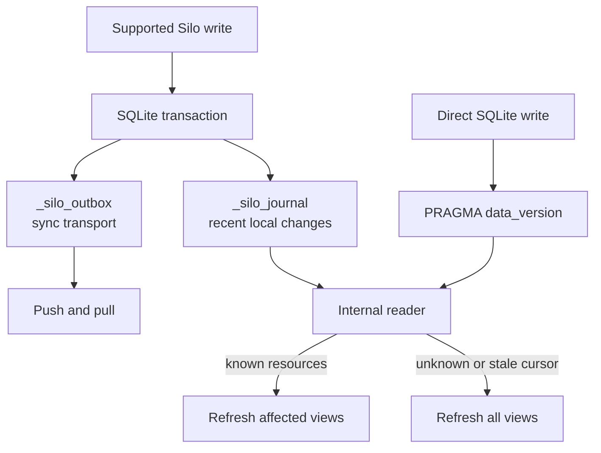

# Mutation journal

> Record which local resources may need refreshing after a Silo write.

The mutation journal is bounded internal metadata. It helps long-lived Silo
components notice changes, but it is not an audit log or a record of every
past value. The Rust CLI does not expose a journal polling command or a
standalone application API.

When synchronization is configured, a supported write commits its journal
entry and pending outbox change in the same SQLite transaction. They serve
different purposes: a push can clear the outbox without clearing the journal.

```mermaid
flowchart TB
  write["Supported Silo write"] --> transaction["SQLite transaction"]
  transaction --> journal["_silo_journal\nrecent local changes"]
  transaction --> outbox["_silo_outbox\nsync transport"]
  outbox --> sync["Push and pull"]
  direct["Direct SQLite write"] --> version["PRAGMA data_version"]
  journal --> reader["Internal reader"]
  version --> reader
  reader -->|"known resources"| refresh["Refresh affected views"]
  reader -->|"unknown or stale cursor"| full["Refresh all views"]
```

## Change signals

Journal entries identify resources that may need refreshing. The observing
connection's SQLite `data_version` can also detect a commit made by a direct
SQLite writer, but it cannot identify the changed resource. Direct writes
bypass Silo validation and synchronization bookkeeping.

Internal consumers should treat the journal as an invalidation hint:

| Result                  | Response                                                                   |
| ----------------------- | -------------------------------------------------------------------------- |
| Journal entries         | Refresh views that depend on the entry's `resource_tags`.                  |
| `full_refresh_required` | Reload current data, then continue from `latest_sequence`.                 |
| `unknown_change`        | Reload all data because Silo cannot attribute the observed external write. |

The journal does not calculate which queries depend on a resource. A consumer
that maps `table:issues` to displayed views owns that mapping itself.

## Entry contract

Each entry contains:

| Field            | Meaning                                                                                                                 |
| ---------------- | ----------------------------------------------------------------------------------------------------------------------- |
| `sequence`       | Database-local monotonic sequence. Retention removes older entries, so the history can contain gaps.                    |
| `transaction_id` | Unique transaction identity. With synchronization configured, it matches the corresponding outbox transaction identity. |
| `committed_at`   | ISO timestamp recorded at the mutation's commit boundary.                                                               |
| `operation`      | Structured context such as a command and table or resource name. It is metadata, not a replay command.                  |
| `resource_tags`  | Opaque resource identifiers. The `*` tag means any resource may be stale.                                               |

Silo uses these resource tag shapes:

| Change                             | Resource tags                         |
| ---------------------------------- | ------------------------------------- |
| Rows in one table                  | `table:<table-name>`                  |
| An operation naming several tables | One table tag for each affected table |
| Saved query                        | `query:<query-name>`                  |
| Report, including a failed refresh | `report:<report-slug>`                |
| Schema or other broad change       | `*`                                   |

For example, a `row.update` entry for `issues` can identify every view that
uses `table:issues`. The tag does not identify individual changed rows.

## Retention and migration

Silo retains the newest 1,000 entries. Internal journal reads return at most
100 entries at a time. When the cursor is older than the retained range,
`full_refresh_required` is set and no partial history is returned. Internal
consumers reload current data and resume at `latest_sequence`.

Older databases may not have a journal table. The first writable open creates
it for future writes; earlier changes are not backfilled.

## Boundaries

The journal does not provide:

- the identity of the person or process that made a change;
- before-and-after row values;
- unlimited history or managed reader cursors;
- a user-facing polling command; or
- resource attribution for direct SQLite writes.

For atomic persistence, see [Atomic commits](atomic-transactions.md). For
remote checkpoints and synchronization conflict handling, see
[Synchronization model](synchronization.md).
