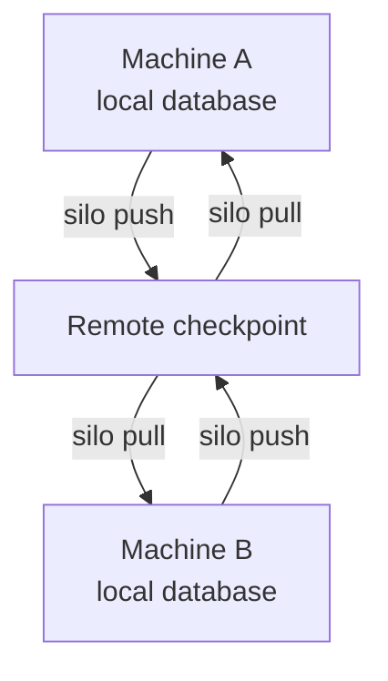

# Synchronization Model

> Understand what push and pull guarantee, how conflicts stop them, and what your storage service must provide.

## Local first, explicit sharing

Each machine keeps an active SQLite database on local storage. Reads and writes
work offline. Run `silo push` to publish local work and `silo pull` to receive
published work. Neither runs in the background.

The diagram shows how two machines exchange data through a remote checkpoint:



The remote holds a published copy for sharing and recovery. Ordinary Silo
commands query the local database, not the remote.

After synchronization is enabled, Silo records local changes as pending
transactions. These include:

- Row changes
- Saved-query definitions and deletions
- Report scripts and legacy report queries
- Rendered report results and refresh status
- Report deletions

Local work is not protected by a remote checkpoint until push confirms it.
[Atomic transactions](atomic-transactions.md) can group changes across tables.
Synchronization reapplies or rejects each group as a whole.

The [mutation journal](mutation-journal.md) has a different job: it helps local
readers notice changes. It is not used to transport changes between machines.

## What the remote stores

Under your configured storage prefix, Silo writes:

```text
<prefix>/HEAD
<prefix>/generations/<generation-id>/...
```

A **generation** is an immutable Litestream checkpoint. `HEAD` is a small,
versioned manifest that names the current generation. It records:

- The content hash and schema revision
- The database identity generated during synchronization setup
- The expected Git workspace identity
- The parent generation
- A unique publication identifier used to recognize a completed push

The Git workspace identity helps detect the wrong database. It does not prove
that a caller is authorized; access is controlled by the storage service.

Initialization starts from one existing copy:

- An existing local database can initialize an empty remote.
- An existing remote can restore an absent local database.
- If both exist, you must choose which copy to use. Silo does not merge their
  application rows during setup.

## Recovery preserves both authorities

When both copies exist, the recovery command requires you to choose a side and
confirm the exact remote generation. The local database must be unconfigured,
and the remote manifest must match the current Git workspace identity.

**Adopt remote** keeps the remote copy:

1. Restore and verify the remote checkpoint in a temporary file.
2. Back up the existing local database beside the active file.
3. Install the restored remote database atomically.

The reported `recovery-local-<id>.sqlite` backup preserves the original schema,
data, and synchronization metadata. Silo does not replace the active file until
that backup succeeds.

**Replace remote** keeps the local copy:

1. Configure a temporary copy of the local database.
2. Publish and independently verify a new checkpoint.
3. Update `HEAD` only if the confirmed remote version is still current.
4. Configure or replace the active local database after publication is confirmed.

The displaced remote generation remains at the location reported by the
command. The new manifest also records it as the parent generation.

If a network response is ambiguous, Silo rereads `HEAD`. It recognizes success
only when the publication identifier matches this operation. A different or
newer head is not treated as success.

These steps keep the original local database in place until it is safe to
replace it. After a successful replacement, the losing copy remains available
for recovery. Keep or remove that copy according to your own backup policy;
Silo does not provide automatic history retention.

## What publication guarantees

Before advancing `HEAD`, push publishes a new generation and restores it
independently. Silo checks:

- The content hash
- Database and Git workspace identities
- The logical schema and generated SQLite objects
- SQLite integrity

The `HEAD` update is conditional on the entity tag read earlier. This means
only a publisher using the current remote version can replace it.

If another publisher wins, Silo leaves its own generation unreferenced. It
reads the winning version, reapplies non-conflicting local transactions, and
tries again. An uncertain network result is checked against the unique
publication identifier. Local transactions become clean only after the new
head is confirmed.

Conflicts stop publication:

| Concurrent change                                                     | Result                                                      |
| --------------------------------------------------------------------- | ----------------------------------------------------------- |
| Different rows, queries, or reports change and constraints still hold | Silo reapplies pending transactions in order.               |
| The same row, query, or report changes incompatibly                   | Pull or push stops; the active local database is preserved. |
| Reapplying a transaction would violate a constraint                   | Pull or push stops; the active local database is preserved. |
| The remote and pending transaction use incompatible schemas           | Pull or push stops; the active local database is preserved. |

For example, two agents can change separate issues if the combined result
still satisfies the schema. Incompatible edits to the same issue require a
person or agent to decide what to keep. Silo does not silently choose the last
writer.

Schema changes require a fully pulled base with no pending synchronization
transactions. They publish as full checkpoints. If another schema change wins,
discard the losing schema transaction and deliberately reapply a compatible
change against the new schema. Concurrent schema changes are not merged.

## What operators and the object store guarantee

Once `HEAD` is confirmed, its checkpoint can restore a machine with no local
copy. Keeping that checkpoint available is the storage service's responsibility.
Configure your bucket for the protection you need:

- Access control and encryption
- Retention and versioning
- Replication and disaster recovery

Silo uses the standard AWS credential chain. Litestream must be able to access
the same destination. Set `AWS_ENDPOINT_URL_S3` for a custom S3-compatible
endpoint. Credentials stay outside SQLite; you own their permissions and
rotation.

### Cleanup and retention

`silo sync prune` previews cleanup by default. It only considers generations
older than the configured grace period and excludes the generation named by
`HEAD`. Before deleting, it checks the `HEAD` entity tag again. If publication
changed the pointer during discovery, cleanup stops without deleting anything.

The grace period protects recent publication candidates. Push creates a new,
uniquely named generation before advancing `HEAD`; cleanup must leave enough
time for an in-flight publication or recovery to finish. Use a longer period
when those operations can take longer.

Restrict direct changes or rollbacks to `HEAD` in your bucket policy. Cleanup
assumes writers follow Silo's publication protocol and does not replace
object-store versioning or backups. Remote generations are protocol data, not
a user-facing commit history.

## Current limits

- Litestream 0.5.12 or newer is required and installed separately.
- Only S3-compatible remotes with conditional object writes are supported.
- The active SQLite database must remain on local storage.
- Every synchronized table needs a stable, non-null primary key.
- Pull, push, and database replacement lock out concurrent Silo writers while
  they run.
- There is no hosted coordinator or background cleanup.
- There are no database branches, checkouts, or user-facing audit history.
- Silo does not store or manage storage credentials.

Silo removes temporary restores and candidate files after use. Anyone with
write access to the remote `HEAD` and generation prefix can affect which data
other machines restore. Local process checks do not replace storage permissions.

See [Synchronize a database](../guides/synchronize.md) for setup and recovery
commands.
