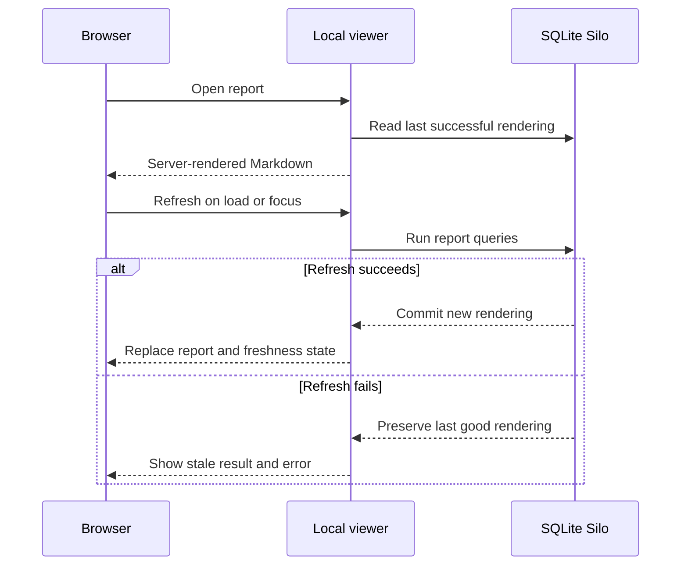

# Publish a Refreshable Report

> Turn current Silo data into a durable human-readable brief whose query-backed sections can refresh without asking an agent to rewrite the report.

## Separate durable framing from changing facts

A report stores four things in the same Silo as its source data:

- a stable lowercase `slug`;
- a human-readable `title`;
- a Markdown template containing named query slots; and
- report query definitions whose results replace those slots.

Put definitions, caveats, and other durable context in ordinary Markdown. Put counts, lists, dates, and other changing facts in `{{silo-query:name}}` slots. Refresh reruns SQL and renders its results as GitHub-flavored Markdown tables; it does not invoke an agent or change ordinary prose.

Each report query must have exactly one valid name and at least one matching slot. Every slot must name a report query, and unused queries are rejected. A report query contains either inline read-only SQL or a reference to a reusable saved query with fixed parameters. Inline SQL must return columns and cannot read Silo's internal tables. Silo renders at most 500 rows per query and marks truncated results.

## Define and save the report

Create an execution brief after the `tasks` table contains data:

```json
{
  "slug": "execution-brief",
  "title": "Project execution brief",
  "markdown": "# Project execution brief\n\nA current view of project delivery.\n\n## Work by status\n\n{{silo-query:work_by_status}}\n\n## Blocked work\n\n{{silo-query:blocked_work}}",
  "queries": [
    {
      "name": "work_by_status",
      "sql": "SELECT status, count(*) AS tasks FROM tasks GROUP BY status ORDER BY tasks DESC"
    },
    {
      "name": "blocked_work",
      "sql": "SELECT title, updated_at FROM tasks WHERE status = 'blocked' ORDER BY updated_at",
      "empty_markdown": "_No blocked work._"
    }
  ]
}
```

Save it from a file:

```sh
silo report put --file execution-brief.json
```

`report put` is idempotent by slug. Silo validates the complete definition, runs every query from one consistent database snapshot, and publishes the definition and initial rendering atomically. If validation or a query fails, an existing report with that slug remains unchanged.

## Reuse a typed saved query

Reference a saved query when its typed read should also serve CLI callers or another report. For example, after defining `blocked-work`, replace inline SQL with a reference and fixed named bindings:

```json
{
  "name": "blocked_work",
  "saved_query": "blocked-work",
  "parameters": {
    "owner": "alec"
  },
  "empty_markdown": "_No blocked work._"
}
```

Named saved queries receive a parameter object. Positional saved queries receive an array in declaration order:

```json
{
  "name": "task_history",
  "saved_query": "task-history",
  "parameters": ["550e8400-e29b-41d4-a716-446655440000", 20]
}
```

Omit `parameters` only when the saved query declares no required inputs. Refresh resolves the current definition, validates the fixed values through its semantic types, and executes its current SQL. Updating a referenced saved query can therefore change or break the next report refresh; failure retains the last good rendering. Silo prevents deletion until all referencing reports are replaced or deleted.

Inspect the stored rendering and query provenance:

```sh
silo report show execution-brief
```

The output identifies the last successful refresh and shows each inline SQL definition or saved-query reference with its fixed parameters. Add `ORDER BY` whenever presentation order matters; SQLite does not otherwise guarantee row order.

## Open the human viewer

Start the packaged viewer from the repository associated with the Silo:

```sh
silo report open execution-brief
```

The foreground command binds a Node.js HTTP server to a random loopback port, opens the default browser, and runs until interrupted. The initial React-rendered page returns the last successful Markdown immediately. Browser JavaScript then requests a refresh after the page opens and whenever it regains focus; simultaneous refresh requests are deduplicated.



The viewer exposes refresh status, last-refreshed time, and report query provenance. It renders GitHub-flavored Markdown without executing report-authored HTML. The refresh endpoint accepts requests only from its loopback origin with the per-server token embedded in the page; it is not a remote hosting or authentication boundary.

Interrupt the CLI command to stop the server.

## Refresh or manage reports from the CLI

Use the report command that matches the intended side effect:

| Command                      | Result                                                                  |
| ---------------------------- | ----------------------------------------------------------------------- |
| `silo report list`           | Lists reports and their most recent refresh state.                      |
| `silo report show <slug>`    | Shows the last good rendering and query provenance without refreshing.  |
| `silo report refresh <slug>` | Reruns all report queries and atomically publishes a successful result. |
| `silo report put`            | Creates or replaces a definition and performs its initial refresh.      |
| `silo report open <slug>`    | Starts the local viewer and refreshes on page load and focus.           |
| `silo report delete <slug>`  | Permanently deletes the report definition, queries, and rendering.      |

If refresh fails, Silo records the error and attempt time but retains the previous rendering. Correct the source data, schema, or SQL, then run `silo report refresh <slug>` again. Replace the definition with `report put` when its Markdown or SQL must change.

> [!WARNING]
> `silo report delete` is permanent. Run `silo report show <slug>` first when the saved SQL or authored framing may still be needed.

## Share reports through explicit synchronization

When synchronization is configured, report definitions, reusable saved queries, rendered snapshots, refresh state, and deletions join the same pending transaction stream as row mutations. They remain local until `silo push`; another machine receives them through `silo pull`.

> [!IMPORTANT]
> Opening or refocusing the viewer performs a refresh, which updates report metadata and creates a pending report transaction in a synchronized Silo. Check `silo sync status` and push when that refreshed snapshot should be shared.

Concurrent mutations of different reports can rebase. Mutations of the same report may conflict like changes to the same row. Preserve any definition, SQL, reference, or fixed bindings you need, use the transaction-aware recovery in [Synchronize a database](synchronize.md#recover-from-a-row-conflict), then put or refresh the reconciled report against current data.

For validation failures and stale viewer states, continue with [Troubleshooting](../troubleshooting.md#a-report-cannot-be-saved-or-refreshed).
