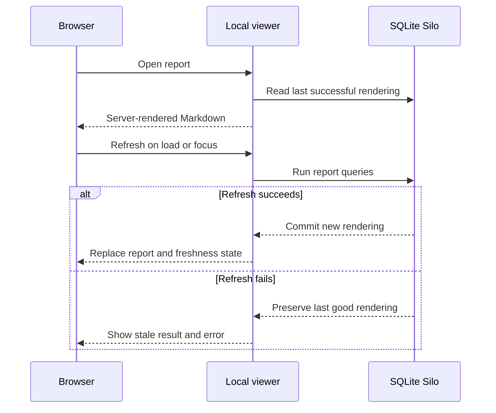

# Publish a Refreshable Report

> Turn current Silo data into a durable human-readable brief whose changing sections refresh without rewriting its authored Markdown.

A report is a read surface over the same local Silo database as its source
rows. It combines:

- authored Markdown that explains the context;
- named query slots such as `{{silo-query:issue_list}}`;
- inline SQL or saved-query references that fill those slots; and
- the last successful rendered Markdown snapshot.

Put durable framing, caveats, and definitions in ordinary Markdown. Put counts,
lists, dates, and other changing facts in query slots. Refresh reruns the
queries; it does not invoke an agent or change the ordinary prose.

## Define and save a report

This example assumes the `issues` table from [Getting started](../getting-started.md).
Save the following request as `issue-brief.json`:

```json
{
  "slug": "issue-brief",
  "title": "Project issue brief",
  "markdown": "# Project issue brief\n\nA current view of repository issues.\n\n## Total\n\n{{silo-query:issue_count}}\n\n## Issues\n\n{{silo-query:issue_list}}",
  "queries": [
    {
      "name": "issue_count",
      "sql": "SELECT count(*) AS issues FROM issues"
    },
    {
      "name": "issue_list",
      "sql": "SELECT id, title FROM issues ORDER BY title",
      "empty_markdown": "_No issues._"
    }
  ]
}
```

Validate it without changing saved report state, then save it and perform the
initial refresh:

```sh
silo report validate --file issue-brief.json
silo report put --file issue-brief.json
silo report show issue-brief
```

`report validate` parses the candidate and runs every query from one consistent
database snapshot through the same read-only boundary used by report refreshes.
It does not save a rendered snapshot, update an existing report, or create
pending synchronization work.

`report put` validates the complete definition, runs every query from one
consistent database snapshot, and publishes the definition and initial
rendering atomically. If validation or a query fails, an existing report with
that slug remains unchanged.

Every query must be used by at least one matching slot. A slot can be repeated
when the same result belongs in more than one section. Each query must contain
either one read-only inline SQL statement or one saved-query reference. Inline
SQL must return columns and cannot read Silo's internal tables. Each query
renders at most 500 rows and marks truncation when necessary.

## Reuse a typed saved query

Reference a saved query when the same typed read should serve CLI callers and a
report. First define a query such as `find-issues` using [Run saved
queries](run-saved-queries.md), then replace the inline `issue_list` definition
with this entry:

```json
{
  "name": "issue_list",
  "saved_query": "find-issues",
  "parameters": {
    "prefix": "release"
  },
  "empty_markdown": "_No release issues._"
}
```

Named saved queries receive a parameter object. Positional saved queries
receive an array in declaration order. Omit `parameters` only when the saved
query has no required inputs.

Each refresh resolves the current saved-query definition, validates the fixed
values through its semantic types, and executes its current SQL. Updating a
referenced query can therefore change or break the next report refresh; a
failed refresh retains the last good rendering. Silo prevents deletion while
any report still references the query.

Inspect only the stored authored definition when the rendered snapshot is too
large for useful terminal output:

```sh
silo report show issue-brief --definition
```

The definition-only view emits the title, Markdown template, inline SQL or
saved-query references, fixed parameters, and empty-result Markdown as JSON.
It omits the rendering and refresh metadata. Inspect the stored rendering and
query provenance together with:

```sh
silo report show issue-brief
```

The output identifies the last successful refresh and shows each inline SQL
definition or saved-query reference with its fixed parameters. Add `ORDER BY`
whenever presentation order matters; SQLite does not otherwise guarantee row
order.

## Open the human viewer

Start the packaged viewer from the repository associated with the Silo database:

```sh
silo report open issue-brief
```

The foreground command starts a loopback HTTP server, opens the default
browser, and runs until interrupted. The initial page shows the last successful
rendering immediately. Browser JavaScript requests a refresh after the page
opens and whenever it regains focus.


```mermaid
sequenceDiagram
  participant Browser
  participant Viewer as Local viewer
  participant Silo as SQLite Silo
  Browser->>Viewer: Open report
  Viewer->>Silo: Read last successful rendering
  Viewer-->>Browser: Server-rendered Markdown
  Browser->>Viewer: Refresh on load or focus
  Viewer->>Silo: Run report queries
  alt Refresh succeeds
    Silo-->>Viewer: Commit new rendering
    Viewer-->>Browser: Replace report and freshness state
  else Refresh fails
    Silo-->>Viewer: Preserve last good rendering
    Viewer-->>Browser: Show stale result and error
  end
```

The viewer exposes refresh status, last-refreshed time, and query provenance. It
renders GitHub-flavored Markdown without executing report-authored HTML. The
refresh endpoint is restricted to the local viewer's origin and per-server
token; the viewer is not remote hosting or an authentication boundary.

Interrupt the CLI command to stop the server.

## Refresh or manage reports from the CLI

| Command                                | Result                                                                 |
| -------------------------------------- | ---------------------------------------------------------------------- |
| `silo report validate`                 | Checks a candidate and runs its queries without saving it.             |
| `silo report list`                     | Lists reports and their most recent refresh state.                     |
| `silo report show <slug>`              | Shows the last good rendering and query provenance without refreshing. |
| `silo report show <slug> --definition` | Shows only the stored authored definition as JSON.                     |
| `silo report refresh <slug>`           | Reruns all queries and atomically publishes a successful result.       |
| `silo report put`                      | Creates or replaces a definition and performs its initial refresh.     |
| `silo report open <slug>`              | Starts the local viewer and refreshes on page load and focus.          |
| `silo report delete <slug>`            | Permanently deletes the report definition, queries, and rendering.     |

If refresh fails, Silo records the error and attempt time but retains the
previous rendering. Correct the source data, schema, or SQL, then run:

```sh
silo report refresh issue-brief
```

Replace the definition with `report put` when its Markdown or SQL must change.

> [!WARNING]
> `silo report delete` is permanent. Run `silo report show <slug>` first when the saved SQL or authored framing may still be needed.

## Share reports through explicit synchronization

When synchronization is configured, report definitions, reusable saved queries,
rendered snapshots, refresh state, and deletions join the same pending
transaction stream as row mutations. They remain local until `silo push`; a
different machine receives them through `silo pull`.

> [!IMPORTANT]
> Opening or refocusing the viewer performs a refresh. In a synchronized Silo, that refresh updates report metadata and creates pending local work. Check `silo sync status` and push when the new snapshot should be shared.

Concurrent mutations of different reports can rebase. Mutations of the same
report may conflict like changes to the same row. Preserve any definition, SQL,
reference, or fixed bindings you need, use the transaction-aware recovery in
[Synchronize a database](synchronize.md#recover-from-a-conflict), then put
or refresh the reconciled report against current data.

For validation failures and stale viewer states, continue with
[Troubleshooting](../troubleshooting.md#a-report-cannot-be-saved-or-refreshed).
