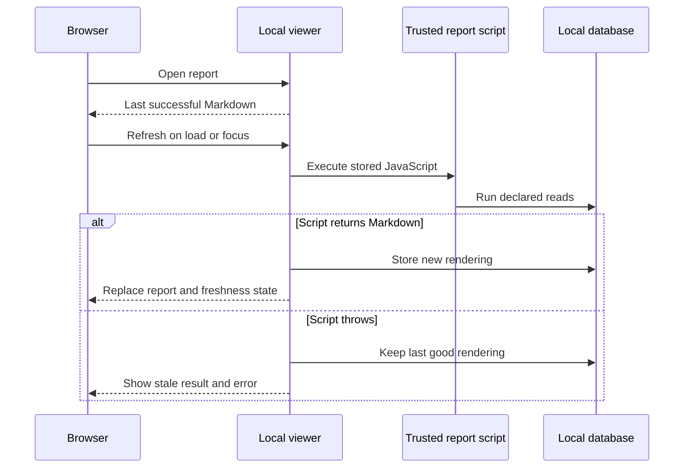

# Publish a refreshable report

> Turn database results into a Markdown report you can open in your browser.

A report runs a JavaScript script and saves the Markdown it returns. For
example, an issue report can list work for a human to review. Opening the
report shows its last successful result while a refresh runs.

Scripts can read the local database through SQL or saved queries. They can
also load Node modules, so only run scripts you trust.

> [!CAUTION]
> Validating, saving, refreshing, or opening a report executes its script with
> Silo's access to your machine. A script can read or change files and use the
> network. Inspect reports from other authors before running them.

## Define and save a report

This example assumes the `issues` table from [Getting started](../getting-started.md). Save this definition as `issue-brief.json`:

```json
{
  "slug": "issue-brief",
  "title": "Project issue brief",
  "script": "const issues = silo.sql('SELECT id, title FROM issues ORDER BY title')\n\nreturn [\n  '# Project issue brief',\n  issues.rows.length ? markdown.table(issues) : '_No issues._',\n].join('\\n\\n')"
}
```

Validate it, save it, then inspect the result:

```sh
silo report validate --file issue-brief.json
silo report put --file issue-brief.json
silo report show issue-brief
```

The output of `report show` should include your issue in a Markdown table. If
the table is empty, it shows `_No issues._`.

`report validate` runs the candidate without saving it. It does not prevent
side effects from the script itself.

`report put` runs the script before replacing the stored definition and rendering. If the script throws or returns an invalid value, an existing report with the same slug remains unchanged.

A script must return a Markdown string synchronously. Do not use top-level
`await` or return a promise. This lets Silo keep the database reads and saved
result in one SQLite transaction.

## Use the report script API

Silo calls the stored script as a function body with three arguments:

| Name                            | Purpose                                                                                         |
| ------------------------------- | ----------------------------------------------------------------------------------------------- |
| `silo.workspace`                | The Git workspace's `root`, `identity`, and `origin`.                                           |
| `silo.sql(sql, parameters?)`    | Runs one bounded read-only SQL statement. Parameters may be a named object or positional array. |
| `silo.query(name, parameters?)` | Runs a saved query through its typed parameter contract.                                        |
| `markdown.table(result)`        | Renders a query result as a GitHub-flavored Markdown table.                                     |
| `require`                       | Loads synchronous Node modules and repository dependencies relative to the workspace root.      |

Both query methods return:

```ts
{
  columns: string[]
  rows: unknown[][]
  truncated: boolean
}
```

Each call returns at most 500 rows. To show a warning when more rows match,
replace `issue-brief.json` with this version, then save it with
`silo report put --file issue-brief.json`:

```json
{
  "slug": "issue-brief",
  "title": "Project issue brief",
  "script": "const issues = silo.sql(\n  \"SELECT id, title FROM issues WHERE title LIKE :prefix || '%' ORDER BY title\",\n  { prefix: 'Document' },\n)\n\nconst body = issues.rows.length ? markdown.table(issues) : '_No matching issues._'\nconst warning = issues.truncated ? '> Results truncated to 500 rows.' : ''\nreturn ['# Project issue brief', body, warning].filter(Boolean).join('\\n\\n')"
}
```

This version lists titles beginning with `Document`. With fewer than 501
matches, it shows no truncation warning.

`silo.sql` is read-only and cannot access Silo's internal tables. The script
itself can still use Node APIs directly.

## Reuse a saved query

After defining `find-issues` in [Run saved queries](run-saved-queries.md), you
can use this script body to reuse it:

```js
const issues = silo.query('find-issues', { prefix: 'Document' })

return [
  '# Project issue brief',
  issues.rows.length ? markdown.table(issues) : '_No matching issues._',
].join('\n\n')
```

Each run uses the current saved-query definition. Updating or deleting that
query can break the next refresh; Silo does not scan scripts to find their
dependencies. A failed refresh keeps the last successful result.

## Load repository code

`require` resolves files and dependencies from the Git workspace root. To try
this example, first create `reports/render-issue.cjs` in that repository:

```js
module.exports = (title) => `- ${title}`
```

Then use this report script body:

```js
const { format } = require('node:util')
const renderIssue = require('./reports/render-issue.cjs')

const issues = silo.sql('SELECT id, title FROM issues ORDER BY id')
return issues.rows.map((row) => renderIssue(format('%s', row[1]))).join('\n')
```

The result is a Markdown list of issue titles.

Silo synchronizes the stored script. It does not copy required files or
packages. Every machine running this example needs `reports/render-issue.cjs`.
Use synchronous modules and APIs.

## Inspect the definition and rendering

To inspect or save the script without its rendered output:

```sh
silo report show issue-brief --definition
```

The definition view shows `slug`, `title`, and `script` in a fenced JSON block.
To reuse it as a `--file` input, copy the JSON without the heading or code fences.
Show the last successful result and script together with:

```sh
silo report show issue-brief
```

## Open the local viewer

Start the packaged viewer from the associated Git repository:

```sh
silo report open issue-brief
```

The command starts a local server and opens your browser. The page displays
the last successful result, then refreshes. It refreshes again whenever the
page regains focus. The diagram shows what happens when refresh succeeds or fails:


```mermaid
sequenceDiagram
  participant Browser
  participant Viewer as Local viewer
  participant Script as Trusted report script
  participant Silo as Local database
  Browser->>Viewer: Open report
  Viewer-->>Browser: Last successful Markdown
  Browser->>Viewer: Refresh on load or focus
  Viewer->>Script: Execute stored JavaScript
  Script->>Silo: Run declared reads
  alt Script returns Markdown
    Viewer->>Silo: Store new rendering
    Viewer-->>Browser: Replace report and freshness state
  else Script throws
    Viewer->>Silo: Keep last good rendering
    Viewer-->>Browser: Show stale result and error
  end
```

The viewer displays GitHub-flavored Markdown without executing embedded HTML.
The report script runs in the local Silo process. This viewer is for local use;
it does not provide remote hosting or an authentication system.

Interrupt the CLI command to stop the server.

## Refresh or manage reports from the CLI

| Command                                | Result                                                         |
| -------------------------------------- | -------------------------------------------------------------- |
| `silo report validate`                 | Runs a candidate without saving report state.                  |
| `silo report list`                     | Lists reports and their latest refresh state.                  |
| `silo report show <slug>`              | Shows the last successful rendering and stored script.         |
| `silo report show <slug> --definition` | Shows the definition in a fenced JSON block.                   |
| `silo report refresh <slug>`           | Reruns the script and atomically stores a successful result.   |
| `silo report put`                      | Creates or replaces a definition and performs its initial run. |
| `silo report open <slug>`              | Starts the local viewer and refreshes on page load and focus.  |
| `silo report delete <slug>`            | Permanently deletes the definition and rendering.              |

If a refresh fails, Silo records the error and attempt time while retaining the previous rendering. Fix the script, its dependencies, or its source data. Use `report put` for a changed script and `report refresh` when the stored script can succeed without replacement.

> [!WARNING]
> `silo report delete` is permanent. Save the definition first if you may need
> it again, for example with `silo report show issue-brief --definition > issue-brief-backup.md`.

## Existing Markdown and query reports

Silo still reads, refreshes, synchronizes, and replaces legacy definitions that contain `markdown` and `queries`. That format is deprecated. New reports and bundled templates should use `script`.

A legacy report keeps its existing behavior, including fixed saved-query bindings, query provenance, query slots, and automatic table formatting. Replacing it with a scripted definition removes its stored query rows after the new script runs successfully.

## Share reports through explicit synchronization

Report changes remain local until `silo push`. Another machine receives them
through `silo pull`. This includes:

- Scripts
- Saved Markdown results
- Refresh status
- Deletions

Pulling a report stores code but does not execute it. Validating, putting, refreshing, or opening it does.

> [!IMPORTANT]
> Opening or refocusing the viewer refreshes the report. In a synchronized Silo, a successful refresh updates report metadata and creates pending local work. Check `silo sync status` and push when the new snapshot should be shared.

Changes to different reports can be combined. Changes to the same report may
conflict. Preserve the script you need, follow the recovery steps in [Synchronize a database](synchronize.md#recover-from-a-conflict), then put or refresh the reconciled report.

For failures and stale viewer states, continue with [Troubleshooting](../troubleshooting.md#a-report-cannot-be-saved-or-refreshed).
