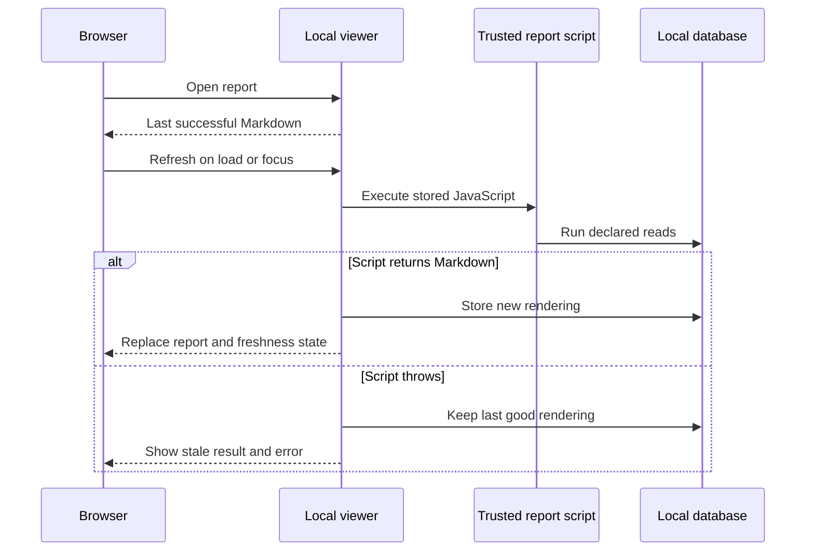

# Publish a refreshable report

> Run trusted JavaScript against the local Silo database and keep its latest successful Markdown rendering.

A report stores a synchronous JavaScript function body and the last Markdown string that it returned. The script can run read-only SQL, call saved queries, format tables, read workspace metadata, and use synchronous Node modules.

> [!CAUTION]
> Report scripts are trusted code. `report validate`, `report put`, `report refresh`, and the automatic refresh performed by `report open` execute the script with the Silo process's full operating-system authority. Inspect synchronized reports before running them when you do not trust their author.

## Define and save a report

This example assumes the `issues` table from [Getting started](../getting-started.md). Save this definition as `issue-brief.json`:

```json
{
  "slug": "issue-brief",
  "title": "Project issue brief",
  "script": "const issues = silo.sql('SELECT id, title FROM issues ORDER BY title')\n\nreturn [\n  '# Project issue brief',\n  issues.rows.length ? markdown.table(issues) : '_No issues._',\n].join('\\n\\n')"
}
```

Validate it, save it, then inspect the rendering:

```sh
silo report validate --file issue-brief.json
silo report put --file issue-brief.json
silo report show issue-brief
```

`report validate` parses and runs the candidate without changing saved report state. It still executes trusted code, so filesystem, network, and other process side effects are possible.

`report put` runs the script before replacing the stored definition and rendering. If the script throws or returns an invalid value, an existing report with the same slug remains unchanged.

A script must return a Markdown string synchronously. Returning a promise fails validation. Synchronous execution keeps database reads and the saved rendering inside the same SQLite transaction used by template imports, report updates, and refreshes.

## Use the report script API

Silo calls the stored script as a function body with three arguments:

| Name                            | Purpose                                                                                         |
| ------------------------------- | ----------------------------------------------------------------------------------------------- |
| `silo.workspace`                | The Git workspace's `root`, `identity`, and `origin`.                                           |
| `silo.sql(sql, parameters?)`    | Runs one bounded read-only SQL statement. Parameters may be a named object or positional array. |
| `silo.query(name, parameters?)` | Runs a saved query through its typed parameter contract.                                        |
| `markdown.table(result)`        | Renders a query result as a GitHub-flavored Markdown table.                                     |
| `require`                       | Loads synchronous Node modules and repository dependencies relative to the workspace root.      |

Both query methods return:

```ts
{
  columns: string[]
  rows: unknown[][]
  truncated: boolean
}
```

Each call returns at most 500 rows. The script decides how to present an empty or truncated result:

```json
{
  "slug": "release-issues",
  "title": "Release issues",
  "script": "const issues = silo.sql(\n  'SELECT id, title FROM issues WHERE status = :status ORDER BY title',\n  { status: 'open' },\n)\n\nconst body = issues.rows.length ? markdown.table(issues) : '_No open issues._'\nconst warning = issues.truncated ? '> Results truncated to 500 rows.' : ''\nreturn ['# Release issues', body, warning].filter(Boolean).join('\\n\\n')"
}
```

SQL run through `silo.sql` remains read-only and cannot access Silo's internal tables. This is an API rule, not a security boundary. Trusted JavaScript can use Node APIs directly.

## Reuse a saved query

Use `silo.query` when a typed read should serve CLI callers and reports. If the `find-issues` query declares a named `prefix` parameter:

```js
const issues = silo.query('find-issues', { prefix: 'release' })

return [
  '# Release issues',
  issues.rows.length ? markdown.table(issues) : '_No release issues._',
].join('\n\n')
```

Silo resolves the current saved-query definition on every run. Updating or deleting that query can break the next report refresh. Script references are dynamic, so Silo does not prevent deletion by scanning report source. A failed refresh retains the last successful rendering.

## Load repository code

The injected `require` resolves from the Git workspace root:

```js
const { format } = require('node:util')
const renderIssue = require('./reports/render-issue.cjs')

const issues = silo.sql('SELECT id, title FROM issues ORDER BY id')
return issues.rows.map((row) => renderIssue(format('%s', row[1]))).join('\n')
```

Silo synchronizes the report script, not its required files or packages. Every machine that runs the report must have compatible repository files and dependencies. Scripts cannot use top-level `await`; use synchronous modules and APIs.

## Inspect the definition and rendering

Show only the stored authored definition when the rendered Markdown is too large for terminal inspection:

```sh
silo report show issue-brief --definition
```

The definition view emits `slug`, `title`, and `script` as JSON. Show the last successful rendering and script together with:

```sh
silo report show issue-brief
```

## Open the local viewer

Start the packaged viewer from the associated Git repository:

```sh
silo report open issue-brief
```

The initial page displays the last successful rendering. Browser JavaScript requests a refresh after the page opens and whenever the page regains focus.


```mermaid
sequenceDiagram
  participant Browser
  participant Viewer as Local viewer
  participant Script as Trusted report script
  participant Silo as Local database
  Browser->>Viewer: Open report
  Viewer-->>Browser: Last successful Markdown
  Browser->>Viewer: Refresh on load or focus
  Viewer->>Script: Execute stored JavaScript
  Script->>Silo: Run declared reads
  alt Script returns Markdown
    Viewer->>Silo: Store new rendering
    Viewer-->>Browser: Replace report and freshness state
  else Script throws
    Viewer->>Silo: Keep last good rendering
    Viewer-->>Browser: Show stale result and error
  end
```

The viewer renders GitHub-flavored Markdown without executing HTML embedded in the returned Markdown. The report script runs in the local Silo process before rendering. The viewer is not a remote hosting or authentication boundary.

Interrupt the CLI command to stop the server.

## Refresh or manage reports from the CLI

| Command                                | Result                                                         |
| -------------------------------------- | -------------------------------------------------------------- |
| `silo report validate`                 | Runs a candidate without saving report state.                  |
| `silo report list`                     | Lists reports and their latest refresh state.                  |
| `silo report show <slug>`              | Shows the last successful rendering and stored script.         |
| `silo report show <slug> --definition` | Shows the authored definition as JSON.                         |
| `silo report refresh <slug>`           | Reruns the script and atomically stores a successful result.   |
| `silo report put`                      | Creates or replaces a definition and performs its initial run. |
| `silo report open <slug>`              | Starts the local viewer and refreshes on page load and focus.  |
| `silo report delete <slug>`            | Permanently deletes the definition and rendering.              |

If a refresh fails, Silo records the error and attempt time while retaining the previous rendering. Fix the script, its dependencies, or its source data. Use `report put` for a changed script and `report refresh` when the stored script can succeed without replacement.

> [!WARNING]
> `silo report delete` is permanent. Run `silo report show <slug> --definition` first when the script may still be needed.

## Existing Markdown and query reports

Silo still reads, refreshes, synchronizes, and replaces legacy definitions that contain `markdown` and `queries`. That format is deprecated. New reports and bundled templates should use `script`.

A legacy report keeps its existing behavior, including fixed saved-query bindings, query provenance, query slots, and automatic table formatting. Replacing it with a scripted definition removes its stored query rows after the new script runs successfully.

## Share reports through explicit synchronization

Report scripts, rendered snapshots, refresh state, and deletions join the same pending transaction stream as row and saved-query mutations. They remain local until `silo push`; another machine receives them through `silo pull`.

Pulling a report stores code but does not execute it. Validating, putting, refreshing, or opening it does.

> [!IMPORTANT]
> Opening or refocusing the viewer refreshes the report. In a synchronized Silo, a successful refresh updates report metadata and creates pending local work. Check `silo sync status` and push when the new snapshot should be shared.

Concurrent mutations of different reports can rebase. Mutations of the same report may conflict like changes to the same row. Preserve the script you need, use the transaction-aware recovery in [Synchronize a database](synchronize.md#recover-from-a-conflict), then put or refresh the reconciled report.

For failures and stale viewer states, continue with [Troubleshooting](../troubleshooting.md#a-report-cannot-be-saved-or-refreshed).
