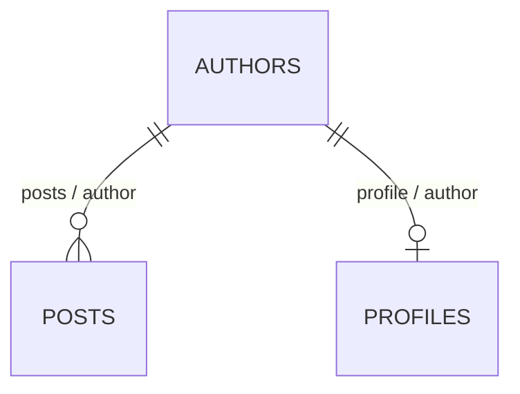

# Semantic relations

> Name and document domain relationships that are implemented by existing SQLite foreign keys; Silo derives their cardinality and leaves query presentation to consumers.

## Why relations are separate from foreign keys

A foreign key preserves physical referential integrity:

```text
posts.author_id → authors.id
```

A semantic relation explains what that constraint means in the domain:

```text
posts.author  = Author responsible for this post.
authors.posts = Posts authored by this author.
```

The foreign key remains the enforcement mechanism. The relation is durable
logical metadata for agents, documentation generators, SDKs, and other
consumers. A bare foreign key is valid when its domain name or documentation
does not add useful meaning.

The direction and inverse are easier to see in a small model:



The first relationship has many posts per author. The second has at most one
profile per author because the profile's local foreign key is unique.

## Relation definition

Relations live in the top-level `relations` array of the logical schema:

```json
{
  "from": {
    "table": "posts",
    "columns": ["author_id"],
    "name": "author"
  },
  "to": {
    "table": "authors",
    "columns": ["id"]
  },
  "inverse_name": "posts",
  "comment": "Author responsible for this post.",
  "inverse_comment": "Posts authored by this author."
}
```

`from.name` is the semantic identifier exposed from the referencing table.
`inverse_name` is optional; Silo never invents one. The source `comment` is
required. When an inverse name is supplied, `inverse_comment` is required too
so both directions remain self-describing.

The endpoint columns and tables must exactly match one declared foreign key:

| Relation field | Matching foreign-key field    |
| -------------- | ----------------------------- |
| `from.table`   | local table containing the FK |
| `from.columns` | ordered local FK columns      |
| `to.table`     | referenced table              |
| `to.columns`   | ordered referenced columns    |

Column order matters. A relation is rejected when it describes an arbitrary
join, points to a different key, or could match more than one declared
foreign key.

## Derived cardinality and optionality

Relations do not persist `one`, `many`, or `optional` fields. Silo derives them
from the logical relational contract:

- Every source row relates to at most one target row, so the source cardinality
  is `one`; this does not make the whole relationship one-to-one.
- The source side is `required` when every local FK column is `NOT NULL` and
  `optional` otherwise.
- The inverse side is `one` when the local FK columns are covered exactly by a
  primary key or unconditional unique key; otherwise it is `many`.

For a composite foreign key, SQLite treats the relationship as absent when
any local key column is `NULL`. Silo therefore reports a composite source as
optional when any local FK column is nullable. The FK's ordered columns still
have to match the relation exactly.

For example:

```text
profiles.author_id UNIQUE → authors.id
```

derives an optional source relationship and a one-valued inverse. In contrast,
`posts.author_id → authors.id` without a local uniqueness constraint derives a
required source relationship and a many-valued inverse.

## Multiple relationships and junction tables

Different foreign keys between the same tables can have different semantic
names:

```text
posts.author_id → authors.id  = posts.author
posts.editor_id → authors.id  = posts.editor
```

Their inverse names must also be distinct when both are declared. Relation
names are unique within a table's semantic-relation namespace, but they are
not currently required to avoid column names.

Do not add a special many-to-many relation for a junction table. Model its
foreign keys normally:

```text
post_categories.post     → posts.id
post_categories.category → categories.id
```

A future consumer may recognize the junction-table pattern, but Silo does not
turn it into an ORM relationship or generate joins.

## Commands and inspection

Relations are managed after their tables and foreign keys exist:

```sh
silo relation add --file relation.json
silo relation list
silo relation show posts author
silo relation remove posts author
```

`silo schema show` lists every relation and its derived cardinality.
`silo table show <table>` lists outgoing relations and named inverse relations
targeting that table. `silo schema export` preserves the authored relation
metadata; derived cardinality is intentionally not serialized.

Templates may include the same top-level `relations` array. Silo validates
their tables, columns, exact backing foreign keys, and name conflicts against
the complete post-import schema before applying the import.

Current relations must have a real foreign key. They do not add SQLite
objects, relation-aware SQL, traversal syntax, generated joins, virtual
fields, presentation metadata, or CMS behavior.
