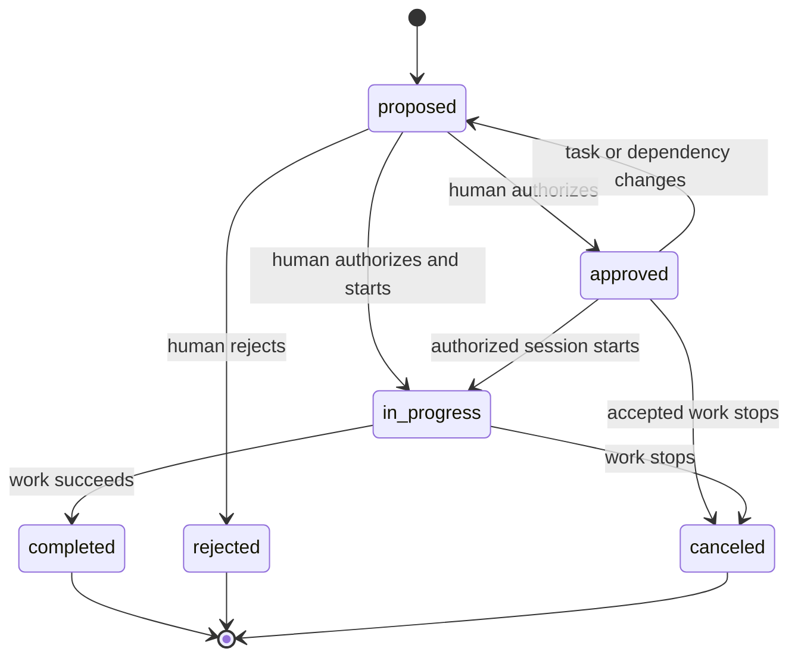

# Tasks Template

> Start with tables for proposed tasks, human approval, and agent progress.

Use this template when you want agents to propose work and track it after a
human authorizes it. It provides tables and operating instructions that are
copied into your local database.

The approval workflow belongs to this template. Other Silo tables can use
different workflows. Importing the template does not authorize an agent to
start any of its tasks.

## Import the template

The template ships with Silo. From the Git worktree that should own the task
data, inspect the workspace and import it:

```sh
silo status
silo template show tasks
silo schema import tasks
silo schema show
```

`template show` prints and validates the template without changing the database.
`schema import` adds its four tables and default report. It creates the local
database if needed.

Check the final output for the four tables listed below and the instructions
marked `template:tasks`. Agents must read those instructions before acting.

> [!IMPORTANT]
> Import copies the template once. Updating Silo or editing the installed
> template does not update a database that already imported it.

An import fails if the schema already contains any of the template's table
names or if a default report already has the same slug. Other templates can be
imported alongside `tasks` when their table names and default report slugs do
not conflict.

## What it installs

| Table               | One row represents                                          | Important behavior                                                                                            |
| ------------------- | ----------------------------------------------------------- | ------------------------------------------------------------------------------------------------------------- |
| `tasks`             | One task, from proposal through completion or cancellation. | Generates a UUID, timestamps, and an optimistic revision; preserves proposal identity fields after insertion. |
| `task_dependencies` | One task that must finish before another can start.         | Rejects direct self-dependencies and prevents deletion of a task that another task still depends on.          |
| `task_tags`         | One allowed tag attached to a task.                         | Accepts only the template's work-mode and cross-cutting tags.                                                 |
| `task_sessions`     | One agent session working on an authorized task.            | Connects a human-initiated agent session to its task and optional terminal outcome.                           |

The schema checks values and references, rejects a task depending on itself,
and manages generated fields and revisions.

Agents must follow the imported instructions for rules the database does not
enforce on its own:

- Obtaining human authorization
- Detecting dependency cycles
- Clearing approval after a task or dependency changes
- Moving tasks between states

## Use the default report

The `tasks-overview` report shows:

- Task counts by state
- Proposals waiting for approval
- Approved and active work
- Unfinished dependencies
- Agent session activity

It needs no parameters. Inspect it or open the local viewer:

```sh
silo report list
silo report show tasks-overview
silo report open tasks-overview
```

The report is copied when the template is imported. Later edits to the bundled
template do not change an existing report; replace it explicitly with
`silo report put` when the report definition should change.

## Task states

Priority and rank determine ordering; they do not authorize work. This diagram
shows the allowed workflow:



The diagram describes the operating contract; agents must still read the
attributed instructions in `silo schema show` before acting.

## Propose a task

Agents may create tasks only in the default `proposed` state and must leave
approval fields empty. Save a proposal as `task.json`:

```json
{
  "title": "Document the release process",
  "objective": "Describe the supported release and rollback workflow for maintainers.",
  "acceptance_criteria": "The guide includes verification and rollback steps.",
  "rank": "a0",
  "proposed_by_type": "agent",
  "proposed_by": "release-planner",
  "proposed_in_session": "session-release-planning-01"
}
```

Add the proposal and keep the generated task ID:

```sh
silo row add tasks --file task.json
```

The saved row includes:

- A generated `id`
- `state: "proposed"`
- `priority: "normal"`
- A revision and timestamps

A human-created proposal uses `"proposed_by_type": "human"`. Creating that
proposal still does not authorize execution.

## Authorize and start work

Before starting:

- Read the task and every dependency.
- Check that every dependency is `completed`.
- For a separately approved task, check that `approved_revision` matches the
  current `revision`.

A human-started session may approve and start only the task ID named in the
human prompt. Follow the imported instructions to record approval and the
`in_progress` transition, then add a `task_sessions` row before substantive
work begins.

Include `_expected_revision` in every task update. A stale update then fails
instead of overwriting another agent's work. See [Work with rows](../guides/work-with-rows.md#update-without-overwriting-concurrent-work).

When an approved task changes, agents must return it to `proposed` and clear
its approval fields. The authorized start transition is the exception. Adding
or removing a dependency also requires resetting approval. Changing tags does
not. These are agent responsibilities, not automatic database transitions.

## Complete or stop work

- When work succeeds, set the task to `completed`, record `completed_at`, and
  close its active session with outcome `completed`.
- When a human declines a proposal, use `rejected`.
- When previously accepted or active work should stop, use `canceled`.

## Order and classify work

Order active tasks by priority: `high`, `normal`, then `low`. Within each
priority, sort by `rank` ascending. Rank is an ordering string, not a score.
Choose a string that sorts between its neighbors when inserting or reordering.

Tags are optional. Allowed values:

- `research`
- `review`
- `documentation`
- `maintenance`
- `migration`
- `automation`
- `security`
- `performance`
- `reliability`

Ordinary implementation work needs no tag. Use the dedicated fields for state
and priority. Model ownership or other project-specific labels separately.
