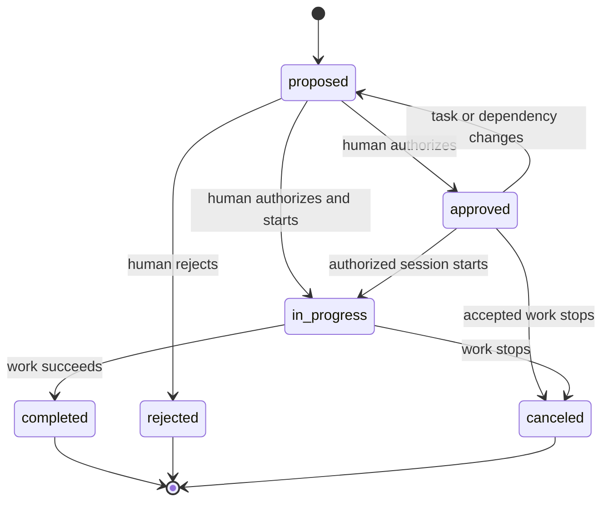

# Tasks Template

> Import a durable agent-work queue that keeps proposals separate from human authorization, records dependencies, and tracks execution attempts.

Use this template when a repository needs a shared queue for agent work. It is
a concrete workflow built on Silo, not a special storage mode: the tables,
types, policies, and attributed instructions are copied into the workspace's
logical schema.

## Import the template

The template ships with Silo. From the Git worktree that should own the task
data, inspect the workspace and import it:

```sh
silo status
silo template show tasks
silo schema import tasks
silo schema show
```

`template show` validates and prints the installed template without changing
the workspace. `schema import` creates the workspace database when none exists,
or adds the template's four tables to an existing schema. The final command
shows the imported tables and the attributed `template:tasks` instructions that
agents must follow.

> [!IMPORTANT]
> Import is a one-time schema copy, not a subscription. Later changes to the installed `tasks` template do not update a workspace that already imported it.

An import fails if the schema already contains any of the template's table
names. Other templates can be imported alongside `tasks` when their table names
do not conflict.

## What it installs

| Table               | One row represents                                              | Important behavior                                                                                            |
| ------------------- | --------------------------------------------------------------- | ------------------------------------------------------------------------------------------------------------- |
| `tasks`             | A proposed, authorized, active, or terminal unit of agent work. | Generates a UUID, timestamps, and an optimistic revision; preserves proposal identity fields after insertion. |
| `task_dependencies` | A prerequisite edge from one task to another.                   | Rejects direct self-dependencies and prevents deletion of a task that another task still depends on.          |
| `task_tags`         | One optional predefined classification attached to a task.      | Accepts only the template's work-mode and cross-cutting tags.                                                 |
| `task_sessions`     | One agent execution attempt for an authorized task.             | Connects a human-initiated agent session to its task and optional terminal outcome.                           |

The schema enforces types, keys, foreign keys, the direct self-dependency
check, generated values, and revision handling. Attributed instructions govern
rules SQLite cannot establish by itself, including the human authorization
boundary, dependency-cycle detection, approval invalidation, and lifecycle
transitions.

The lifecycle is intentionally separate from proposal priority or rank:



The diagram describes the operating contract; agents must still read the
attributed instructions in `silo schema show` before acting.

## Propose a task

Agents may create tasks only in the default `proposed` state and must leave
approval fields empty. Save a proposal as `task.json`:

```json
{
  "title": "Document the release process",
  "objective": "Describe the supported release and rollback workflow for maintainers.",
  "acceptance_criteria": "The guide includes verification and rollback steps.",
  "rank": "a0",
  "proposed_by_type": "agent",
  "proposed_by": "release-planner",
  "proposed_in_session": "session-release-planning-01"
}
```

Add the proposal and retain the generated task ID from the complete persisted
row:

```sh
silo row add tasks --file task.json
```

Silo supplies `id`, `state: "proposed"`, `priority: "normal"`, `revision`,
`created_at`, and `updated_at`. A human-created proposal uses
`"proposed_by_type": "human"`; its presence still does not authorize
execution.

## Authorize and start work

Before starting a task, read the task and every dependency. All dependencies
must be `completed`. For a separately approved task,
`approved_revision` must match the current `revision`.

A human-started session may approve and start only the task ID referenced by
that human prompt. It must record the execution attempt in `task_sessions`
before substantive work begins. Use `_expected_revision` for every task update
so concurrent changes fail instead of being overwritten; see [Work with
rows](../guides/work-with-rows.md#update-without-overwriting-concurrent-work).

Editing an approved task invalidates its approval unless the edit is the
authorized transition into `in_progress`. Adding or removing a dependency also
returns the task to `proposed`; changing tags does not. Detect dependency
cycles before inserting them.

## Complete or stop work

When work succeeds, move the task to `completed`, set `completed_at`, and close
the active session with the `completed` outcome. Use `rejected` when a human
declines a proposal, and `canceled` when previously accepted or active work
should stop.

## Order and classify work

Order active tasks by `high`, `normal`, then `low` priority, and by ascending
`rank` within each priority. Rank is an opaque fractional-indexing string:
choose a value between adjacent ranks when inserting or reordering instead of
deriving meaning from the string itself.

Tags are optional. Allowed values are `research`, `review`, `documentation`,
`maintenance`, `migration`, `automation`, `security`, `performance`, and
`reliability`. Ordinary implementation tasks need no tag; state, priority,
ownership, and domain labels belong in their dedicated fields or a separately
designed schema.
